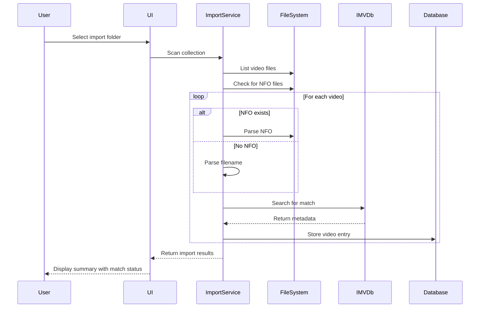
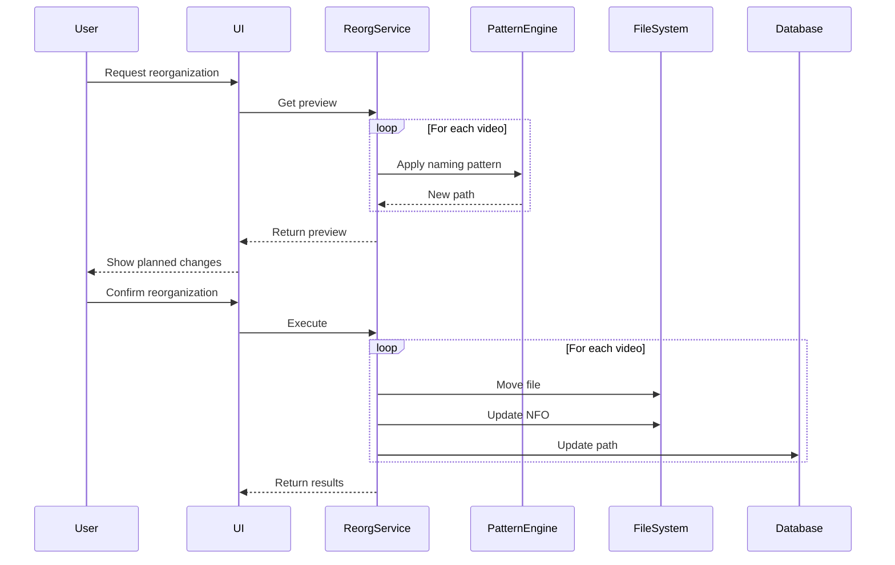

# Video Jockey C# Architecture - Self-Contained Edition

## Core Architecture Principles

### Database-Driven Configuration
All configuration, including API keys and system settings, is stored in the SQLite database and managed through the application's UI. No environment variables are required for configuration.

### Technology Decisions
- **Database**: SQLite only (via Entity Framework Core)
- **Configuration**: Stored in database, managed via admin UI
- **Deployment**: Single container with zero external configuration

## Database Schema

### Configuration Storage

```csharp
// Configuration entity stored in SQLite
public class SystemConfiguration
{
    public int Id { get; set; } = 1; // Single row
    public DateTime LastModified { get; set; }
    
    // API Keys (encrypted in database)
    public string ImvdbApiKey { get; set; }
    
    // Storage Settings
    public string MediaPath { get; set; } = "/media";
    public string TempPath { get; set; } = "/data/temp";
    public long MaxStorageBytes { get; set; } = 536_870_912_000; // 500GB
    public long MaxFileSizeBytes { get; set; } = 2_147_483_648; // 2GB
    
    // Download Settings
    public int ConcurrentDownloadLimit { get; set; } = 3;
    public int RetryAttempts { get; set; } = 3;
    public string QualityPreference { get; set; } = "1080p";
    public int RateLimitMbps { get; set; } = 10;
    
    // NFO Generation Settings
    public bool IncludeFeaturedArtistsInTitle { get; set; } = false;
    public bool IncludeFeaturedArtistsInArtist { get; set; } = true;
    public string FeaturedArtistSeparator { get; set; } = " feat. ";
    public GenreSpecificity GenreSpecificity { get; set; } = GenreSpecificity.Specific;
    public LabelDisplay LabelDisplay { get; set; } = LabelDisplay.Direct;
    
    // File Organization Settings
    public string DirectoryNamingPattern { get; set; } = "{artist}/{year}";
    public string FileNamingPattern { get; set; } = "{artist} - {title} ({year})";
    public bool SanitizeFilenames { get; set; } = true;
    public string InvalidCharacterReplacement { get; set; } = "_";
    
    // Security Settings
    public string JwtSecret { get; set; } // Auto-generated on first run
    public int JwtExpiryMinutes { get; set; } = 15;
    public int RefreshTokenExpiryDays { get; set; } = 30;
    public int PasswordMinLength { get; set; } = 8;
    public bool RequireDigit { get; set; } = true;
    public bool RequireUppercase { get; set; } = true;
    
    // Feature Flags
    public bool EnableRegistration { get; set; } = true;
    public bool EnableGuestMode { get; set; } = false;
    public bool EnableApiDocs { get; set; } = false;
    public int MaxUsersLimit { get; set; } = 10;
    
    // System Settings
    public bool IsInitialized { get; set; } = false;
    public string AdminEmail { get; set; }
    public DateTime? LastBackup { get; set; }
}

// Enums for configuration
public enum GenreSpecificity
{
    Specific,  // "Crunk", "Post-Grunge"
    Broad      // "Hip Hop/R&B", "Rock"
}

public enum LabelDisplay
{
    Direct,    // Direct record label
    Parent     // Parent company/label
}

// Encrypted field attribute for sensitive data
[AttributeUsage(AttributeTargets.Property)]
public class EncryptedAttribute : Attribute { }

// Entity Framework value converter for encryption
public class EncryptedStringConverter : ValueConverter<string, string>
{
    private readonly IDataProtector _protector;
    
    public EncryptedStringConverter(IDataProtector protector)
        : base(
            v => protector.Protect(v),
            v => protector.Unprotect(v))
    {
        _protector = protector;
    }
}
```

### Database Context

```csharp
public class VideoJockeyDbContext : DbContext
{
    private readonly IDataProtectionProvider _dataProtection;
    
    public VideoJockeyDbContext(
        DbContextOptions<VideoJockeyDbContext> options,
        IDataProtectionProvider dataProtection)
        : base(options)
    {
        _dataProtection = dataProtection;
    }
    
    public DbSet<User> Users { get; set; }
    public DbSet<Video> Videos { get; set; }
    public DbSet<QueueItem> QueueItems { get; set; }
    public DbSet<SystemConfiguration> Configuration { get; set; }
    public DbSet<AuditLog> AuditLogs { get; set; }
    
    protected override void OnModelCreating(ModelBuilder modelBuilder)
    {
        // Configure encryption for sensitive fields
        var protector = _dataProtection.CreateProtector("VideoJockey.Encryption");
        var converter = new EncryptedStringConverter(protector);
        
        modelBuilder.Entity<SystemConfiguration>()
            .Property(e => e.ImvdbApiKey)
            .HasConversion(converter);
            
        modelBuilder.Entity<SystemConfiguration>()
            .Property(e => e.JwtSecret)
            .HasConversion(converter);
            
        // Ensure single configuration row
        modelBuilder.Entity<SystemConfiguration>()
            .HasData(new SystemConfiguration 
            { 
                Id = 1,
                LastModified = DateTime.UtcNow,
                JwtSecret = GenerateSecureKey()
            });
    }
    
    private static string GenerateSecureKey()
    {
        using var rng = RandomNumberGenerator.Create();
        var bytes = new byte[64];
        rng.GetBytes(bytes);
        return Convert.ToBase64String(bytes);
    }
}
```

## Configuration Service

```csharp
public interface IConfigurationService
{
    Task<SystemConfiguration> GetConfigurationAsync();
    Task UpdateConfigurationAsync(SystemConfiguration config);
    Task<bool> IsSystemInitializedAsync();
    Task InitializeSystemAsync(SystemInitDto initDto);
}

public class ConfigurationService : IConfigurationService
{
    private readonly VideoJockeyDbContext _context;
    private readonly IMemoryCache _cache;
    private readonly ILogger<ConfigurationService> _logger;
    private const string CacheKey = "system_configuration";
    
    public ConfigurationService(
        VideoJockeyDbContext context,
        IMemoryCache cache,
        ILogger<ConfigurationService> logger)
    {
        _context = context;
        _cache = cache;
        _logger = logger;
    }
    
    public async Task<SystemConfiguration> GetConfigurationAsync()
    {
        return await _cache.GetOrCreateAsync(CacheKey, async entry =>
        {
            entry.SlidingExpiration = TimeSpan.FromMinutes(5);
            return await _context.Configuration
                .FirstOrDefaultAsync(c => c.Id == 1)
                ?? new SystemConfiguration();
        });
    }
    
    public async Task UpdateConfigurationAsync(SystemConfiguration config)
    {
        config.LastModified = DateTime.UtcNow;
        _context.Configuration.Update(config);
        await _context.SaveChangesAsync();
        
        // Invalidate cache
        _cache.Remove(CacheKey);
        
        _logger.LogInformation("System configuration updated");
    }
    
    public async Task<bool> IsSystemInitializedAsync()
    {
        var config = await GetConfigurationAsync();
        return config.IsInitialized;
    }
    
    public async Task InitializeSystemAsync(SystemInitDto initDto)
    {
        var config = await GetConfigurationAsync();
        
        // Create admin user
        var adminUser = new User
        {
            Id = Guid.NewGuid(),
            Email = initDto.AdminEmail,
            Username = "admin",
            PasswordHash = HashPassword(initDto.AdminPassword),
            IsAdmin = true,
            CreatedAt = DateTime.UtcNow
        };
        
        _context.Users.Add(adminUser);
        
        // Update configuration
        config.AdminEmail = initDto.AdminEmail;
        config.IsInitialized = true;
        config.ImvdbApiKey = initDto.ImvdbApiKey;
        
        await UpdateConfigurationAsync(config);
        
        _logger.LogInformation("System initialized with admin user: {Email}", 
            initDto.AdminEmail);
    }
}
```

## First-Run Setup Wizard

```razor
@page "/setup"
@layout EmptyLayout

@if (!IsInitialized)
{
    <MudContainer MaxWidth="MaxWidth.Small" Class="mt-8">
        <MudCard>
            <MudCardContent>
                <MudText Typo="Typo.h4" Class="mb-4">Welcome to Video Jockey</MudText>
                <MudText Typo="Typo.body1" Class="mb-4">
                    Let's set up your system. This wizard will only run once.
                </MudText>
                
                <MudStepper @ref="stepper">
                    <MudStep Title="Admin Account">
                        <MudTextField 
                            Label="Admin Email" 
                            @bind-Value="InitData.AdminEmail"
                            Required="true"
                            InputType="InputType.Email" />
                        <MudTextField 
                            Label="Admin Password" 
                            @bind-Value="InitData.AdminPassword"
                            Required="true"
                            InputType="InputType.Password" />
                        <MudTextField 
                            Label="Confirm Password" 
                            @bind-Value="ConfirmPassword"
                            Required="true"
                            InputType="InputType.Password" />
                    </MudStep>
                    
                    <MudStep Title="Storage Settings">
                        <MudTextField 
                            Label="Media Storage Path" 
                            @bind-Value="InitData.MediaPath"
                            HelperText="Where to store video files" />
                        <MudNumericField 
                            Label="Max Storage (GB)" 
                            @bind-Value="MaxStorageGB"
                            Min="10" Max="10000" />
                    </MudStep>
                    
                    <MudStep Title="API Keys (Optional)">
                        <MudAlert Severity="Severity.Info" Class="mb-4">
                            API keys can be added later in Settings
                        </MudAlert>
                        <MudTextField 
                            Label="IMVDb API Key" 
                            @bind-Value="InitData.ImvdbApiKey"
                            HelperText="For metadata enrichment"
                            InputType="InputType.Password" />
                    </MudStep>
                    
                    <MudStep Title="Complete Setup">
                        <MudText>Ready to initialize Video Jockey!</MudText>
                        <MudButton 
                            Color="Color.Primary" 
                            Variant="Variant.Filled"
                            OnClick="CompleteSetup"
                            Class="mt-4">
                            Complete Setup
                        </MudButton>
                    </MudStep>
                </MudStepper>
            </MudCardContent>
        </MudCard>
    </MudContainer>
}
else
{
    <MudContainer>
        <MudAlert Severity="Severity.Success">
            System is already initialized. Redirecting to login...
        </MudAlert>
    </MudContainer>
}

@code {
    private SystemInitDto InitData = new();
    private string ConfirmPassword;
    private int MaxStorageGB = 500;
    private MudStepper stepper;
    
    protected override async Task OnInitializedAsync()
    {
        IsInitialized = await ConfigService.IsSystemInitializedAsync();
        if (IsInitialized)
        {
            NavigationManager.NavigateTo("/login");
        }
    }
    
    private async Task CompleteSetup()
    {
        if (InitData.AdminPassword != ConfirmPassword)
        {
            Snackbar.Add("Passwords do not match", Severity.Error);
            return;
        }
        
        InitData.MaxStorageBytes = MaxStorageGB * 1_073_741_824L;
        
        await ConfigService.InitializeSystemAsync(InitData);
        NavigationManager.NavigateTo("/login");
    }
}
```

## Settings Management UI

```razor
@page "/settings"
@attribute [Authorize(Roles = "Admin")]

<MudContainer>
    <MudTabs>
        <MudTabPanel Text="General">
            <MudGrid>
                <MudItem xs="12" md="6">
                    <MudCard>
                        <MudCardContent>
                            <MudText Typo="Typo.h6">System Settings</MudText>
                            <MudSwitch 
                                @bind-Checked="Config.EnableRegistration"
                                Label="Allow User Registration" />
                            <MudSwitch 
                                @bind-Checked="Config.EnableGuestMode"
                                Label="Enable Guest Mode" />
                            <MudNumericField 
                                Label="Max Users"
                                @bind-Value="Config.MaxUsersLimit"
                                Min="1" Max="1000" />
                        </MudCardContent>
                    </MudCard>
                </MudItem>
            </MudGrid>
        </MudTabPanel>
        
        <MudTabPanel Text="API Keys">
            <MudGrid>
                <MudItem xs="12" md="6">
                    <MudCard>
                        <MudCardContent>
                            <MudText Typo="Typo.h6">External APIs</MudText>
                            <MudTextField 
                                Label="IMVDb API Key"
                                @bind-Value="Config.ImvdbApiKey"
                                InputType="InputType.Password"
                                Adornment="Adornment.End"
                                AdornmentIcon="@Icons.Material.Filled.Visibility"
                                OnAdornmentClick="ToggleImvdbVisibility" />
                        </MudCardContent>
                    </MudCard>
                </MudItem>
            </MudGrid>
        </MudTabPanel>
        
        <MudTabPanel Text="Storage">
            <MudGrid>
                <MudItem xs="12" md="6">
                    <MudCard>
                        <MudCardContent>
                            <MudText Typo="Typo.h6">Storage Configuration</MudText>
                            <MudTextField 
                                Label="Media Path"
                                @bind-Value="Config.MediaPath"
                                HelperText="Path for video storage" />
                            <MudTextField 
                                Label="Temp Path"
                                @bind-Value="Config.TempPath"
                                HelperText="Path for temporary files" />
                            <MudNumericField 
                                Label="Max Storage (GB)"
                                Value="@(Config.MaxStorageBytes / 1_073_741_824)"
                                ValueChanged="@((long gb) => Config.MaxStorageBytes = gb * 1_073_741_824)"
                                Min="10" Max="10000" />
                        </MudCardContent>
                    </MudCard>
                </MudItem>
                
                <MudItem xs="12" md="6">
                    <MudCard>
                        <MudCardContent>
                            <MudText Typo="Typo.h6">Storage Usage</MudText>
                            <MudProgressLinear 
                                Value="@StoragePercentage" 
                                Color="@(StoragePercentage > 90 ? Color.Error : Color.Primary)" />
                            <MudText>
                                @FormatBytes(StorageUsed) / @FormatBytes(Config.MaxStorageBytes)
                            </MudText>
                        </MudCardContent>
                    </MudCard>
                </MudItem>
            </MudGrid>
        </MudTabPanel>
        
        <MudTabPanel Text="Downloads">
            <MudGrid>
                <MudItem xs="12" md="6">
                    <MudCard>
                        <MudCardContent>
                            <MudText Typo="Typo.h6">Download Settings</MudText>
                            <MudNumericField 
                                Label="Concurrent Downloads"
                                @bind-Value="Config.ConcurrentDownloadLimit"
                                Min="1" Max="10" />
                            <MudNumericField 
                                Label="Retry Attempts"
                                @bind-Value="Config.RetryAttempts"
                                Min="0" Max="10" />
                            <MudSelect 
                                Label="Quality Preference"
                                @bind-Value="Config.QualityPreference">
                                <MudSelectItem Value="@("2160p")">4K (2160p)</MudSelectItem>
                                <MudSelectItem Value="@("1080p")">Full HD (1080p)</MudSelectItem>
                                <MudSelectItem Value="@("720p")">HD (720p)</MudSelectItem>
                                <MudSelectItem Value="@("480p")">SD (480p)</MudSelectItem>
                                <MudSelectItem Value="@("best")">Best Available</MudSelectItem>
                            </MudSelect>
                            <MudNumericField 
                                Label="Rate Limit (Mbps)"
                                @bind-Value="Config.RateLimitMbps"
                                Min="0" Max="1000"
                                HelperText="0 = unlimited" />
                        </MudCardContent>
                    </MudCard>
                </MudItem>
            </MudGrid>
        </MudTabPanel>
        
        <MudTabPanel Text="NFO & Organization">
            <MudGrid>
                <MudItem xs="12" md="6">
                    <MudCard>
                        <MudCardContent>
                            <MudText Typo="Typo.h6">NFO Generation</MudText>
                            <MudSwitch
                                @bind-Checked="Config.IncludeFeaturedArtistsInTitle"
                                Label="Include Featured Artists in Title" />
                            <MudSwitch
                                @bind-Checked="Config.IncludeFeaturedArtistsInArtist"
                                Label="Include Featured Artists in Artist Field" />
                            <MudTextField
                                Label="Featured Artist Separator"
                                @bind-Value="Config.FeaturedArtistSeparator"
                                HelperText="e.g., ' feat. ' or ' ft. '" />
                        </MudCardContent>
                    </MudCard>
                </MudItem>
                
                <MudItem xs="12" md="6">
                    <MudCard>
                        <MudCardContent>
                            <MudText Typo="Typo.h6">File Organization</MudText>
                            <MudTextField
                                Label="Directory Pattern"
                                @bind-Value="Config.DirectoryNamingPattern"
                                HelperText="Variables: {artist}, {year}, {genre}, {album}" />
                            <MudTextField
                                Label="File Name Pattern"
                                @bind-Value="Config.FileNamingPattern"
                                HelperText="Variables: {artist}, {title}, {year}, {featured}" />
                            <MudSwitch
                                @bind-Checked="Config.SanitizeFilenames"
                                Label="Sanitize Filenames" />
                            <MudTextField
                                Label="Invalid Character Replacement"
                                @bind-Value="Config.InvalidCharacterReplacement"
                                HelperText="Replace invalid chars with this" />
                        </MudCardContent>
                    </MudCard>
                </MudItem>
                
                <MudItem xs="12">
                    <MudCard>
                        <MudCardContent>
                            <MudText Typo="Typo.h6">Pattern Examples</MudText>
                            <MudText Typo="Typo.caption" Class="mb-2">
                                Available variables: {artist}, {title}, {album}, {year}, {genre}, {director},
                                {studio}, {label}, {featured}, {artist_full}, {quality}, {date}, {month}, {day}
                            </MudText>
                            <MudSimpleTable Dense="true">
                                <thead>
                                    <tr>
                                        <th>Pattern</th>
                                        <th>Example Result</th>
                                    </tr>
                                </thead>
                                <tbody>
                                    <tr>
                                        <td>{artist}/{year}/{artist} - {title}</td>
                                        <td>Daft Punk/2013/Daft Punk - Get Lucky.mp4</td>
                                    </tr>
                                    <tr>
                                        <td>{genre}/{artist_full} - {title}</td>
                                        <td>Electronic/Daft Punk feat. Pharrell - Get Lucky.mp4</td>
                                    </tr>
                                    <tr>
                                        <td>{year}/{month} - {artist} - {title}</td>
                                        <td>2013/04 - Daft Punk - Get Lucky.mp4</td>
                                    </tr>
                                </tbody>
                            </MudSimpleTable>
                        </MudCardContent>
                    </MudCard>
                </MudItem>
            </MudGrid>
        </MudTabPanel>
        
        <MudTabPanel Text="Security">
            <MudGrid>
                <MudItem xs="12" md="6">
                    <MudCard>
                        <MudCardContent>
                            <MudText Typo="Typo.h6">Password Policy</MudText>
                            <MudNumericField 
                                Label="Minimum Length"
                                @bind-Value="Config.PasswordMinLength"
                                Min="6" Max="32" />
                            <MudSwitch 
                                @bind-Checked="Config.RequireDigit"
                                Label="Require Digit" />
                            <MudSwitch 
                                @bind-Checked="Config.RequireUppercase"
                                Label="Require Uppercase" />
                        </MudCardContent>
                    </MudCard>
                </MudItem>
                
                <MudItem xs="12" md="6">
                    <MudCard>
                        <MudCardContent>
                            <MudText Typo="Typo.h6">Session Settings</MudText>
                            <MudNumericField 
                                Label="JWT Expiry (minutes)"
                                @bind-Value="Config.JwtExpiryMinutes"
                                Min="5" Max="1440" />
                            <MudNumericField 
                                Label="Refresh Token Expiry (days)"
                                @bind-Value="Config.RefreshTokenExpiryDays"
                                Min="1" Max="365" />
                        </MudCardContent>
                    </MudCard>
                </MudItem>
            </MudGrid>
        </MudTabPanel>
    </MudTabs>
    
    <MudPaper Class="pa-4 mt-4">
        <MudButton 
            Color="Color.Primary" 
            Variant="Variant.Filled"
            OnClick="SaveConfiguration">
            Save Changes
        </MudButton>
        <MudButton 
            Color="Color.Default" 
            Variant="Variant.Text"
            OnClick="CancelChanges"
            Class="ml-2">
            Cancel
        </MudButton>
    </MudPaper>
</MudContainer>

@code {
    private SystemConfiguration Config = new();
    private SystemConfiguration OriginalConfig;
    private long StorageUsed;
    private double StoragePercentage => (double)StorageUsed / Config.MaxStorageBytes * 100;
    
    protected override async Task OnInitializedAsync()
    {
        Config = await ConfigService.GetConfigurationAsync();
        OriginalConfig = Config.Clone(); // Deep clone for cancel functionality
        StorageUsed = await StorageService.GetUsedSpaceAsync();
    }
    
    private async Task SaveConfiguration()
    {
        await ConfigService.UpdateConfigurationAsync(Config);
        Snackbar.Add("Configuration saved successfully", Severity.Success);
    }
    
    private void CancelChanges()
    {
        Config = OriginalConfig.Clone();
    }
}
```

## Simplified Deployment

### Docker Container (No Environment Variables)

```dockerfile
FROM mcr.microsoft.com/dotnet/aspnet:8.0-alpine AS runtime
WORKDIR /app

# Install dependencies
RUN apk add --no-cache python3 py3-pip ffmpeg \
    && pip3 install --no-cache-dir --break-system-packages yt-dlp

# Create directories with proper permissions
RUN mkdir -p /data /media /config \
    && chmod 755 /data /media /config

# Copy application
COPY --from=build /app/publish .

# Expose port
EXPOSE 8080

# Health check
HEALTHCHECK --interval=30s --timeout=3s \
    CMD wget --spider -q http://localhost:8080/health || exit 1

# Volume mounts
VOLUME ["/data", "/media"]

# No environment variables needed - all config in database
ENTRYPOINT ["dotnet", "VideoJockey.dll"]
```

### Docker Compose (Simplified)

```yaml
version: '3.8'

services:
  videojockey:
    image: videojockey:latest
    container_name: videojockey
    restart: unless-stopped
    ports:
      - "8080:8080"
    volumes:
      - ./data:/data     # SQLite database and logs
      - ./media:/media   # Video storage
    # No environment variables needed!
```

### First-Run Instructions

```bash
# 1. Start the container
docker-compose up -d

# 2. Open browser to http://localhost:8080
# 3. Complete the setup wizard
# 4. System is ready to use!
```

## Startup Service

```csharp
public class Program
{
    public static async Task Main(string[] args)
    {
        var builder = WebApplication.CreateBuilder(args);
        
        // Configure SQLite
        var dataPath = Path.Combine(
            Environment.GetEnvironmentVariable("DATA_PATH") ?? "/data",
            "videojockey.db");
            
        builder.Services.AddDbContext<VideoJockeyDbContext>(options =>
            options.UseSqlite($"Data Source={dataPath}"));
        
        // Add Data Protection for encryption
        builder.Services.AddDataProtection()
            .PersistKeysToFileSystem(new DirectoryInfo("/data/keys"))
            .SetApplicationName("VideoJockey");
        
        // Add services
        builder.Services.AddScoped<IConfigurationService, ConfigurationService>();
        builder.Services.AddMemoryCache();
        
        // Add Blazor
        builder.Services.AddRazorComponents()
            .AddInteractiveServerComponents();
        
        var app = builder.Build();
        
        // Ensure database exists and is migrated
        using (var scope = app.Services.CreateScope())
        {
            var context = scope.ServiceProvider
                .GetRequiredService<VideoJockeyDbContext>();
            await context.Database.MigrateAsync();
        }
        
        // Check if system needs initialization
        app.Use(async (context, next) =>
        {
            var configService = context.RequestServices
                .GetRequiredService<IConfigurationService>();
                
            if (!await configService.IsSystemInitializedAsync() 
                && !context.Request.Path.StartsWithSegments("/setup"))
            {
                context.Response.Redirect("/setup");
                return;
            }
            
            await next();
        });
        
        app.MapRazorComponents<App>()
            .AddInteractiveServerRenderMode();
            
        app.MapHealthChecks("/health");
        
        await app.RunAsync();
    }
}
```

## Backup and Restore

### Backup Service

```csharp
public class BackupService
{
    private readonly VideoJockeyDbContext _context;
    private readonly IConfigurationService _configService;
    
    public async Task<byte[]> CreateBackupAsync()
    {
        var config = await _configService.GetConfigurationAsync();
        
        using var memoryStream = new MemoryStream();
        using var archive = new ZipArchive(memoryStream, ZipArchiveMode.Create);
        
        // Backup database
        var dbPath = _context.Database.GetDbConnection().ConnectionString
            .Split('=')[1].Split(';')[0];
        var dbEntry = archive.CreateEntry("database.db");
        using (var entryStream = dbEntry.Open())
        using (var fileStream = File.OpenRead(dbPath))
        {
            await fileStream.CopyToAsync(entryStream);
        }
        
        // Backup configuration as JSON (for reference)
        var configEntry = archive.CreateEntry("configuration.json");
        using (var entryStream = configEntry.Open())
        using (var writer = new StreamWriter(entryStream))
        {
            var json = JsonSerializer.Serialize(config, new JsonSerializerOptions 
            { 
                WriteIndented = true 
            });
            await writer.WriteAsync(json);
        }
        
        return memoryStream.ToArray();
    }
    
    public async Task RestoreBackupAsync(Stream backupStream)
    {
        using var archive = new ZipArchive(backupStream, ZipArchiveMode.Read);
        
        // Restore database
        var dbEntry = archive.GetEntry("database.db");
        if (dbEntry != null)
        {
            var dbPath = _context.Database.GetDbConnection().ConnectionString
                .Split('=')[1].Split(';')[0];
            var backupPath = $"{dbPath}.backup";
            
            // Create backup of current database
            File.Copy(dbPath, backupPath, true);
            
            // Restore from archive
            using var entryStream = dbEntry.Open();
            using var fileStream = File.Create(dbPath);
            await entryStream.CopyToAsync(fileStream);
        }
    }

## Data Models

### Video Entity

```csharp
public class Video
{
    public Guid Id { get; set; }
    public string Title { get; set; }
    public string Artist { get; set; }
    public string Album { get; set; }
    public int? Year { get; set; }
    public string Genre { get; set; }
    public string SpecificGenre { get; set; } // e.g., "Crunk"
    public string BroadGenre { get; set; } // e.g., "Hip Hop/R&B"
    public string Director { get; set; }
    public string FilePath { get; set; }
    public string ThumbnailPath { get; set; }
    public VideoSource Source { get; set; }
    public string SourceUrl { get; set; }
    public int? ImvdbId { get; set; }
    public string ImvdbUrl { get; set; }
    public bool IsVerified { get; set; }
    public DateTime CreatedAt { get; set; }
    public DateTime? UpdatedAt { get; set; }
    public DownloadStatus Status { get; set; }
    public long? FileSize { get; set; }
    public int? Duration { get; set; }
    public string Resolution { get; set; }
    public string VideoCodec { get; set; }
    public string AudioCodec { get; set; }
    public List<string> FeaturedArtists { get; set; } = new();
    public string Label { get; set; } // Direct label
    public string ParentLabel { get; set; } // Parent company
    public DateTime? ReleaseDate { get; set; }
    public List<string> Tags { get; set; } = new(); // User-defined tags
}
```

## Service Layer Architecture

### Core Services

1. **VideoService**: CRUD operations for videos with search capabilities
2. **DownloadService**: Manages video downloads
3. **MetadataService**: IMVDb API integration and matching
4. **ThumbnailService**: Thumbnail generation
5. **SearchService**: Real-time full-text search on title and artist
6. **ScheduleService**: Background job scheduling
7. **NfoGeneratorService**: NFO file creation with configurable genre/label
8. **FileOrganizationService**: Pattern-based file naming
9. **CollectionImportService**: Import existing video collections
10. **FileReorganizationService**: Restructure files based on patterns
11. **TagManagementService**: Bulk tag operations

### Collection Import Service

```csharp
public interface ICollectionImportService
{
    Task<ImportResult> ImportCollectionAsync(string basePath);
    Task<ImportPreview> PreviewImportAsync(string basePath);
    Task<Video> ParseNfoFileAsync(string nfoPath);
    Video ParseFromFilename(string filepath);
}

public class ImportResult
{
    public int ImportedCount { get; set; }
    public int MatchedCount { get; set; }
    public List<Video> UnmatchedVideos { get; set; } = new();
    public List<string> Errors { get; set; } = new();
}
```

### File Reorganization Service

```csharp
public interface IFileReorganizationService
{
    Task<ReorganizeResult> ReorganizeCollectionAsync(bool preview = false);
    Task<string> GenerateFilePathAsync(Video video);
}

public class ReorganizeResult
{
    public List<FileChange> Changes { get; set; } = new();
    public int ProcessedCount { get; set; }
    public List<string> Errors { get; set; } = new();
}

public class FileChange
{
    public Guid VideoId { get; set; }
    public string OldPath { get; set; }
    public string NewPath { get; set; }
}
```

## UI Workflows

### Collection Management Page

```razor
@page "/collection"
@attribute [Authorize]

<MudContainer>
    <!-- Real-time Search Bar -->
    <MudTextField @bind-Value="SearchQuery"
        Label="Search Collection"
        Placeholder="Search by artist or title..."
        Immediate="true"
        DebounceInterval="300"
        ValueChanged="OnSearchChanged" />
    
    <!-- Bulk Actions Toolbar -->
    <MudToolBar>
        <MudCheckBox @bind-Checked="SelectAll" Label="Select All" />
        <MudSpacer />
        <MudButton OnClick="ShowBulkTagDialog" Disabled="!HasSelection">
            Manage Tags
        </MudButton>
        <MudButton OnClick="ShowReorganizeDialog" Disabled="!HasSelection">
            Reorganize Files
        </MudButton>
    </MudToolBar>
    
    <!-- Video Grid with Multi-Selection -->
    <MudDataGrid T="Video" 
        Items="@FilteredVideos"
        MultiSelection="true"
        @bind-SelectedItems="SelectedVideos"
        Virtualize="true">
        <Columns>
            <SelectColumn T="Video" />
            <PropertyColumn Property="x => x.Artist" Title="Artist" />
            <PropertyColumn Property="x => x.Title" Title="Title" />
            <TemplateColumn Title="Tags">
                <CellTemplate>
                    @foreach (var tag in context.Item.Tags)
                    {
                        <MudChip Size="Size.Small">@tag</MudChip>
                    }
                </CellTemplate>
            </TemplateColumn>
        </Columns>
    </MudDataGrid>
</MudContainer>
```

## Updated Settings Tab - NFO & Organization

```razor
<MudTabPanel Text="NFO & Organization">
    <MudGrid>
        <MudItem xs="12" md="6">
            <MudCard>
                <MudCardContent>
                    <MudText Typo="Typo.h6">NFO Generation</MudText>
                    
                    <!-- Featured Artists -->
                    <MudSwitch
                        @bind-Checked="Config.IncludeFeaturedArtistsInTitle"
                        Label="Include Featured Artists in Title" />
                    <MudSwitch
                        @bind-Checked="Config.IncludeFeaturedArtistsInArtist"
                        Label="Include Featured Artists in Artist Field" />
                    <MudTextField
                        Label="Featured Artist Separator"
                        @bind-Value="Config.FeaturedArtistSeparator" />
                    
                    <!-- Genre Settings -->
                    <MudSelect Label="Genre Specificity"
                        @bind-Value="Config.GenreSpecificity">
                        <MudSelectItem Value="GenreSpecificity.Specific">
                            Specific (Crunk, Post-Grunge)
                        </MudSelectItem>
                        <MudSelectItem Value="GenreSpecificity.Broad">
                            Broad (Hip Hop/R&B, Rock)
                        </MudSelectItem>
                    </MudSelect>
                    
                    <!-- Label Settings -->
                    <MudSelect Label="Label Display"
                        @bind-Value="Config.LabelDisplay">
                        <MudSelectItem Value="LabelDisplay.Direct">
                            Direct Label
                        </MudSelectItem>
                        <MudSelectItem Value="LabelDisplay.Parent">
                            Parent Company
                        </MudSelectItem>
                    </MudSelect>
                </MudCardContent>
            </MudCard>
        </MudItem>
        
        <MudItem xs="12" md="6">
            <MudCard>
                <MudCardContent>
                    <MudText Typo="Typo.h6">File Organization</MudText>
                    <MudTextField
                        Label="Directory Pattern"
                        @bind-Value="Config.DirectoryNamingPattern"
                        HelperText="Variables: {artist}, {year}, {genre}, {album}" />
                    <MudTextField
                        Label="File Name Pattern"
                        @bind-Value="Config.FileNamingPattern"
                        HelperText="Variables: {artist}, {title}, {year}, {featured}" />
                </MudCardContent>
            </MudCard>
        </MudItem>
    </MudGrid>
</MudTabPanel>
```

## Workflow Diagrams

### Collection Import Flow



### File Reorganization Flow



## Database Schema Updates

```sql
-- Videos table with new fields
CREATE TABLE Videos (
    Id TEXT PRIMARY KEY,
    Title TEXT NOT NULL,
    Artist TEXT NOT NULL,
    Album TEXT,
    Year INTEGER,
    Genre TEXT,
    SpecificGenre TEXT,
    BroadGenre TEXT,
    Director TEXT,
    FilePath TEXT,
    ThumbnailPath TEXT,
    Source INTEGER,
    SourceUrl TEXT,
    ImvdbId INTEGER,
    ImvdbUrl TEXT,
    IsVerified INTEGER,
    CreatedAt TEXT,
    UpdatedAt TEXT,
    Status INTEGER,
    FileSize INTEGER,
    Duration INTEGER,
    Resolution TEXT,
    VideoCodec TEXT,
    AudioCodec TEXT,
    FeaturedArtists TEXT, -- JSON array
    Label TEXT,
    ParentLabel TEXT,
    ReleaseDate TEXT,
    Tags TEXT -- JSON array
);

-- Indexes for search performance
CREATE INDEX idx_videos_artist ON Videos(Artist);
CREATE INDEX idx_videos_title ON Videos(Title);
CREATE INDEX idx_videos_artist_title ON Videos(Artist, Title);
CREATE INDEX idx_videos_genre ON Videos(Genre);
CREATE INDEX idx_videos_year ON Videos(Year);
```
}
```

## Summary

This architecture provides:

1. **True Self-Contained Deployment**: No environment variables needed
2. **Database-Driven Configuration**: All settings stored in SQLite
3. **First-Run Setup Wizard**: Initialize system through web UI
4. **Settings Management UI**: Modify all configuration through the application
5. **Secure Storage**: API keys encrypted in database using Data Protection API
6. **Simple Deployment**: Just mount volumes and access the web UI
7. **Zero External Dependencies**: Everything configured internally

The system is now truly self-hosted and self-contained, requiring only Docker and volume mounts to run.