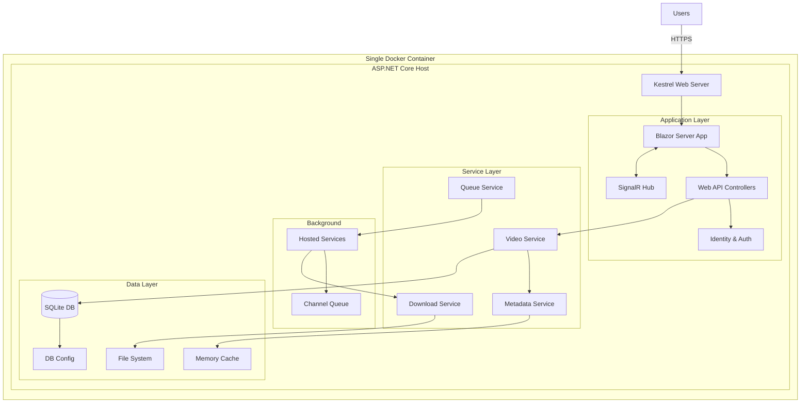

# Product Requirements Document: Video Jockey (C# Edition)

## Executive Summary
Video Jockey is a self-hosted, single-container web application for downloading, organizing, and managing music video collections with metadata sourced from IMVDb (Internet Music Video Database). This refactored version leverages the .NET ecosystem to provide a unified, performant, and easily deployable solution using C# throughout the entire stack.

## Product Overview

### Vision
Create a modern, self-contained web application that automates the acquisition and organization of music videos with rich metadata, deployed as a single Docker container for maximum simplicity and portability.

### Architecture Philosophy
- **Single Language**: C# across the entire stack
- **Single Container**: All components in one Docker image
- **Self-Hosted First**: Optimized for personal/small team deployment
- **Resource Efficient**: Minimal memory and CPU footprint
- **Zero External Dependencies**: Embedded database, no external services required

### Key Features
- Web-based user interface using Blazor Server or Blazor WebAssembly
- IMVDb integration for comprehensive metadata retrieval
- Automated video downloading from YouTube and other sources
- Kodi-compatible NFO metadata generation
- User authentication and session management
- Embedded SQLite database
- In-process background job processing
- Real-time download progress tracking via SignalR
- Single executable deployment option

## Technical Architecture

### Technology Stack (C# Unified)

**Core Platform**:
- **Framework**: ASP.NET Core 8.0
- **Runtime**: .NET 8.0 (with AOT compilation support)
- **Language**: C# 12.0

**Web Layer**:
- **UI Framework**: Blazor Server (recommended) or Blazor WebAssembly
- **CSS Framework**: Bootstrap 5 or Tailwind CSS (via CDN)
- **Component Library**: MudBlazor or Radzen Blazor
- **Real-time**: SignalR Core

**Data Layer**:
- **Database**: SQLite with Entity Framework Core 8.0
- **Configuration Storage**: All settings stored in database (no environment variables)
- **Caching**: In-Memory Cache (IMemoryCache)
- **File Storage**: Local filesystem with database-configured paths
- **Data Protection**: ASP.NET Core Data Protection API for encryption

**Application Services**:
- **Authentication**: ASP.NET Core Identity (simplified)
- **Authorization**: Policy-based with claims
- **Background Jobs**: IHostedService with Channels
- **Configuration**: Database-driven with admin UI
- **Dependency Injection**: Built-in Microsoft.Extensions.DependencyInjection
- **First-Run Setup**: Wizard for initial configuration

**External Integrations**:
- **HTTP Client**: HttpClient with Polly for resilience
- **REST Client**: Refit for type-safe API calls
- **Video Download**: Process wrapper for yt-dlp
- **JSON**: System.Text.Json (built-in)
- **XML (NFO)**: System.Xml.Linq

**Development & Deployment**:
- **Container**: Docker with Alpine Linux base
- **Build**: MSBuild with PublishSingleFile
- **Logging**: Serilog with rolling file sink
- **Configuration**: IConfiguration with appsettings.json
- **Health Checks**: Built-in health check middleware

### Simplified Architecture



## Data Models (C# Classes)

### Core Entities

```csharp
// User entity
public class User
{
    public Guid Id { get; set; }
    public string Email { get; set; }
    public string Username { get; set; }
    public string PasswordHash { get; set; }
    public DateTime CreatedAt { get; set; }
    public DateTime? LastLogin { get; set; }
    public bool IsActive { get; set; } = true;
    public bool IsAdmin { get; set; } = false;
    public long StorageQuotaBytes { get; set; } = 52_428_800_000; // 50GB
    public long StorageUsedBytes { get; set; }
    public UserSettings Settings { get; set; }
}

// System Configuration (stored in database)
public class SystemConfiguration
{
    public int Id { get; set; } = 1; // Single row
    public DateTime LastModified { get; set; }
    
    // API Keys (encrypted in database)
    [Encrypted]
    public string ImvdbApiKey { get; set; }
    
    // Storage Settings
    public string MediaPath { get; set; } = "/media";
    public string TempPath { get; set; } = "/data/temp";
    public long MaxStorageBytes { get; set; } = 536_870_912_000; // 500GB
    
    // Download Settings
    public int ConcurrentDownloadLimit { get; set; } = 3;
    public string QualityPreference { get; set; } = "1080p";
    
    // NFO Generation Settings
    public bool IncludeFeaturedArtistsInTitle { get; set; } = false;
    public bool IncludeFeaturedArtistsInArtist { get; set; } = true;
    public string FeaturedArtistSeparator { get; set; } = " feat. ";
    public GenreSpecificity GenreSpecificity { get; set; } = GenreSpecificity.Specific;
    public LabelDisplay LabelDisplay { get; set; } = LabelDisplay.Direct;
    
    // File Organization Settings
    public string DirectoryNamingPattern { get; set; } = "{artist}/{year}";
    public string FileNamingPattern { get; set; } = "{artist} - {title} ({year})";
    public bool SanitizeFilenames { get; set; } = true;
    public string InvalidCharacterReplacement { get; set; } = "_";
    
    // Security Settings
    [Encrypted]
    public string JwtSecret { get; set; } // Auto-generated on first run
    public int JwtExpiryMinutes { get; set; } = 15;
    
    // System State
    public bool IsInitialized { get; set; } = false;
    public string AdminEmail { get; set; }
}

// Video entity
public class Video
{
    public Guid Id { get; set; }
    public Guid UserId { get; set; }
    public string ImvdbId { get; set; }
    public string YouTubeId { get; set; }
    public string Artist { get; set; }
    public string Title { get; set; }
    public List<string> FeaturedArtists { get; set; } // From IMVDb metadata
    public string Album { get; set; }
    public int? Year { get; set; }
    public string Genre { get; set; }
    public string Director { get; set; }
    public string Studio { get; set; }
    public string Label { get; set; } // Direct record label
    public string ParentLabel { get; set; } // Parent company/label
    public string SpecificGenre { get; set; } // Specific genre (e.g., "Crunk")
    public string BroadGenre { get; set; } // Broad genre (e.g., "Hip Hop/R&B")
    public List<string> Tags { get; set; } = new(); // User-defined tags
    public TimeSpan? Duration { get; set; }
    public string FilePath { get; set; }
    public long? FileSizeBytes { get; set; }
    public DownloadStatus Status { get; set; }
    public VideoSource ActualSource { get; set; }
    public bool SourceVerified { get; set; }
    public DateTime CreatedAt { get; set; }
    public DateTime? DownloadedAt { get; set; }
    public DateTime? ReleaseDate { get; set; } // Original release date
    public Dictionary<string, object> Metadata { get; set; }
}

// Download queue item
public class QueueItem
{
    public Guid Id { get; set; }
    public Guid VideoId { get; set; }
    public Guid UserId { get; set; }
    public QueuePriority Priority { get; set; }
    public QueueStatus Status { get; set; }
    public string SourceUrl { get; set; }
    public string ErrorMessage { get; set; }
    public int RetryCount { get; set; }
    public DateTime CreatedAt { get; set; }
    public DateTime? StartedAt { get; set; }
    public DateTime? CompletedAt { get; set; }
    public double ProgressPercent { get; set; }
}

// Enums
public enum DownloadStatus 
{ 
    NotDownloaded, Queued, Downloading, Completed, Failed 
}

public enum QueueStatus 
{ 
    Waiting, Processing, Completed, Failed, Cancelled 
}

public enum QueuePriority 
{ 
    Low = 0, Normal = 5, High = 10 
}

public enum VideoSource
{
    Unknown, YouTube, Vimeo, Direct, Local
}

public enum GenreSpecificity
{
    Specific,  // "Crunk", "Post-Grunge"
    Broad      // "Hip Hop/R&B", "Rock"
}

public enum LabelDisplay
{
    Direct,    // Direct record label
    Parent     // Parent company/label
}
```

## API Design (Minimal API Style)

### Endpoint Structure

```csharp
// Program.cs endpoint definitions
app.MapGroup("/api/auth")
    .MapIdentityApi<User>(); // Built-in Identity endpoints

var videos = app.MapGroup("/api/videos")
    .RequireAuthorization();

videos.MapGet("/", GetVideosAsync);
videos.MapGet("/{id}", GetVideoAsync);
videos.MapPost("/", CreateVideoAsync);
videos.MapPut("/{id}", UpdateVideoAsync);
videos.MapDelete("/{id}", DeleteVideoAsync);
videos.MapPost("/import", ImportVideosAsync);
videos.MapPost("/{id}/download", QueueDownloadAsync);

var queue = app.MapGroup("/api/queue")
    .RequireAuthorization();

queue.MapGet("/", GetQueueAsync);
queue.MapPost("/{id}/cancel", CancelQueueItemAsync);
queue.MapPost("/{id}/retry", RetryQueueItemAsync);
queue.MapPut("/{id}/priority", UpdatePriorityAsync);

var search = app.MapGroup("/api/search")
    .RequireAuthorization();

search.MapGet("/imvdb", SearchImvdbAsync);
search.MapGet("/videos", SearchVideosAsync); // Using yt-dlp ytsearch

// SignalR hub
app.MapHub<DownloadHub>("/hubs/download");

// Health checks
app.MapHealthChecks("/health");
```

## Web UI Workflows

### Collection Import Workflow

```csharp
// Services/CollectionImportService.cs
public class CollectionImportService
{
    private readonly IVideoService _videoService;
    private readonly IMetadataService _metadataService;
    private readonly ILogger<CollectionImportService> _logger;
    
    public async Task<ImportResult> ImportCollectionAsync(string basePath)
    {
        var result = new ImportResult();
        
        // Step 1: Scan for video files and NFO files
        var videoFiles = Directory.GetFiles(basePath, "*.*", SearchOption.AllDirectories)
            .Where(f => IsVideoFile(f));
            
        foreach (var videoFile in videoFiles)
        {
            try
            {
                // Check for existing NFO file
                var nfoPath = Path.ChangeExtension(videoFile, ".nfo");
                Video video = null;
                
                if (File.Exists(nfoPath))
                {
                    // Parse existing NFO
                    video = await ParseNfoFileAsync(nfoPath);
                    video.FilePath = videoFile;
                }
                else
                {
                    // Parse from filename
                    video = ParseFromFilename(videoFile);
                }
                
                // Try to match with IMVDb
                var imvdbMatch = await _metadataService.FindBestMatchAsync(
                    video.Artist, video.Title, video.Year);
                    
                if (imvdbMatch != null)
                {
                    // Enrich with IMVDb metadata
                    video = MergeWithImvdbData(video, imvdbMatch);
                    result.MatchedCount++;
                }
                else
                {
                    result.UnmatchedVideos.Add(video);
                }
                
                await _videoService.CreateVideoAsync(video);
                result.ImportedCount++;
            }
            catch (Exception ex)
            {
                _logger.LogError(ex, "Failed to import {File}", videoFile);
                result.Errors.Add($"{videoFile}: {ex.Message}");
            }
        }
        
        return result;
    }
    
    private Video ParseFromFilename(string filepath)
    {
        var filename = Path.GetFileNameWithoutExtension(filepath);
        var video = new Video { FilePath = filepath };
        
        // Common patterns to try
        var patterns = new[]
        {
            @"^(?<artist>[^-]+)\s*-\s*(?<title>[^(]+)(?:\((?<year>\d{4})\))?",
            @"^(?<artist>[^-]+)\s*-\s*(?<title>.+)",
            @"^(?<title>.+)$"
        };
        
        foreach (var pattern in patterns)
        {
            var match = Regex.Match(filename, pattern);
            if (match.Success)
            {
                video.Artist = match.Groups["artist"]?.Value?.Trim() ?? "Unknown Artist";
                video.Title = match.Groups["title"]?.Value?.Trim() ?? filename;
                if (int.TryParse(match.Groups["year"]?.Value, out var year))
                {
                    video.Year = year;
                }
                break;
            }
        }
        
        return video;
    }
}
```

### File Organization Workflow

```csharp
// Services/FileReorganizationService.cs
public class FileReorganizationService
{
    private readonly IFileOrganizationService _fileOrgService;
    private readonly IVideoService _videoService;
    private readonly INfoGeneratorService _nfoService;
    
    public async Task<ReorganizeResult> ReorganizeCollectionAsync(
        bool preview = false)
    {
        var result = new ReorganizeResult();
        var videos = await _videoService.GetAllVideosAsync();
        
        foreach (var video in videos)
        {
            var currentPath = video.FilePath;
            var newPath = await _fileOrgService.GenerateFilePathAsync(video);
            
            if (currentPath != newPath)
            {
                result.Changes.Add(new FileChange
                {
                    VideoId = video.Id,
                    OldPath = currentPath,
                    NewPath = newPath
                });
                
                if (!preview)
                {
                    // Create directory if needed
                    var newDir = Path.GetDirectoryName(newPath);
                    Directory.CreateDirectory(newDir);
                    
                    // Move file
                    File.Move(currentPath, newPath);
                    
                    // Update NFO
                    var nfo = await _nfoService.GenerateVideoNfoAsync(video);
                    var nfoPath = Path.ChangeExtension(newPath, ".nfo");
                    await File.WriteAllTextAsync(nfoPath, nfo.ToString());
                    
                    // Update database
                    video.FilePath = newPath;
                    await _videoService.UpdateVideoAsync(video);
                    
                    result.ProcessedCount++;
                }
            }
        }
        
        return result;
    }
}
```

### Bulk Tag Management

```csharp
// Services/TagManagementService.cs
public class TagManagementService
{
    private readonly VideoJockeyDbContext _context;
    
    public async Task AddTagsToVideosAsync(List<Guid> videoIds, List<string> tags)
    {
        var videos = await _context.Videos
            .Where(v => videoIds.Contains(v.Id))
            .ToListAsync();
            
        foreach (var video in videos)
        {
            foreach (var tag in tags)
            {
                if (!video.Tags.Contains(tag, StringComparer.OrdinalIgnoreCase))
                {
                    video.Tags.Add(tag);
                }
            }
        }
        
        await _context.SaveChangesAsync();
    }
    
    public async Task RemoveTagsFromVideosAsync(List<Guid> videoIds, List<string> tags)
    {
        var videos = await _context.Videos
            .Where(v => videoIds.Contains(v.Id))
            .ToListAsync();
            
        foreach (var video in videos)
        {
            video.Tags.RemoveAll(t =>
                tags.Contains(t, StringComparer.OrdinalIgnoreCase));
        }
        
        await _context.SaveChangesAsync();
    }
}
```

## Blazor UI Components

### Collection Import Component

```razor
@page "/import"
@attribute [Authorize]

<MudContainer>
    <MudText Typo="Typo.h4" Class="mb-4">Import Collection</MudText>
    
    <MudCard>
        <MudCardContent>
            <MudTextField @bind-Value="ImportPath"
                Label="Collection Path"
                HelperText="Path to your existing video collection" />
                
            <MudButton Color="Color.Primary"
                OnClick="ScanCollection"
                StartIcon="@Icons.Material.Filled.Search">
                Scan Collection
            </MudButton>
        </MudCardContent>
    </MudCard>
    
    @if (ScanResults != null)
    {
        <MudCard Class="mt-4">
            <MudCardContent>
                <MudText Typo="Typo.h6">Scan Results</MudText>
                <MudSimpleTable>
                    <thead>
                        <tr>
                            <th>File</th>
                            <th>Detected Artist</th>
                            <th>Detected Title</th>
                            <th>IMVDb Match</th>
                            <th>Actions</th>
                        </tr>
                    </thead>
                    <tbody>
                        @foreach (var item in ScanResults)
                        {
                            <tr>
                                <td>@Path.GetFileName(item.FilePath)</td>
                                <td>
                                    <MudTextField @bind-Value="item.Artist"
                                        Variant="Variant.Text" />
                                </td>
                                <td>
                                    <MudTextField @bind-Value="item.Title"
                                        Variant="Variant.Text" />
                                </td>
                                <td>
                                    @if (item.ImvdbMatch != null)
                                    {
                                        <MudChip Color="Color.Success">Matched</MudChip>
                                    }
                                    else
                                    {
                                        <MudChip Color="Color.Warning">No Match</MudChip>
                                    }
                                </td>
                                <td>
                                    <MudIconButton Icon="@Icons.Material.Filled.Search"
                                        OnClick="() => SearchImvdb(item)" />
                                </td>
                            </tr>
                        }
                    </tbody>
                </MudSimpleTable>
                
                <MudButton Color="Color.Primary"
                    OnClick="ImportSelected"
                    Class="mt-4">
                    Import @SelectedCount Selected Videos
                </MudButton>
            </MudCardContent>
        </MudCard>
    }
</MudContainer>
```

### Collection Management Component

```razor
@page "/collection"
@attribute [Authorize]

<MudContainer>
    <MudGrid>
        <MudItem xs="12">
            <MudCard>
                <MudCardContent>
                    <!-- Real-time search -->
                    <MudTextField @bind-Value="SearchQuery"
                        Label="Search Collection"
                        Placeholder="Search by artist or title..."
                        Adornment="Adornment.Start"
                        AdornmentIcon="@Icons.Material.Filled.Search"
                        Immediate="true"
                        DebounceInterval="300"
                        ValueChanged="OnSearchChanged" />
                        
                    <!-- Bulk actions toolbar -->
                    <MudToolBar>
                        <MudCheckBox @bind-Checked="SelectAll"
                            Label="Select All" />
                        <MudSpacer />
                        <MudButton Color="Color.Primary"
                            OnClick="ShowBulkTagDialog"
                            Disabled="!HasSelection">
                            Manage Tags
                        </MudButton>
                        <MudButton Color="Color.Secondary"
                            OnClick="ShowReorganizeDialog"
                            Disabled="!HasSelection">
                            Reorganize Files
                        </MudButton>
                        <MudButton Color="Color.Info"
                            OnClick="RegenerateNfos"
                            Disabled="!HasSelection">
                            Regenerate NFOs
                        </MudButton>
                    </MudToolBar>
                </MudCardContent>
            </MudCard>
        </MudItem>
        
        <MudItem xs="12">
            <MudDataGrid T="Video"
                Items="@FilteredVideos"
                MultiSelection="true"
                @bind-SelectedItems="SelectedVideos"
                QuickFilter="QuickFilter"
                Virtualize="true">
                <Columns>
                    <SelectColumn T="Video" />
                    <PropertyColumn Property="x => x.Artist" Title="Artist" />
                    <PropertyColumn Property="x => x.Title" Title="Title" />
                    <PropertyColumn Property="x => x.Album" Title="Album" />
                    <PropertyColumn Property="x => x.Year" Title="Year" />
                    <PropertyColumn Property="x => x.Genre" Title="Genre" />
                    <TemplateColumn Title="Tags">
                        <CellTemplate>
                            @foreach (var tag in context.Item.Tags)
                            {
                                <MudChip Size="Size.Small">@tag</MudChip>
                            }
                        </CellTemplate>
                    </TemplateColumn>
                    <TemplateColumn Title="Actions">
                        <CellTemplate>
                            <MudIconButton Icon="@Icons.Material.Filled.Edit"
                                OnClick="() => EditVideo(context.Item)" />
                            <MudIconButton Icon="@Icons.Material.Filled.PlayArrow"
                                OnClick="() => PlayVideo(context.Item)" />
                        </CellTemplate>
                    </TemplateColumn>
                </Columns>
            </MudDataGrid>
        </MudItem>
    </MudGrid>
</MudContainer>

<!-- Bulk Tag Management Dialog -->
<MudDialog @bind-IsVisible="ShowTagDialog">
    <TitleContent>
        <MudText Typo="Typo.h6">Manage Tags for @SelectedVideos.Count Videos</MudText>
    </TitleContent>
    <DialogContent>
        <MudChipSet @bind-SelectedChips="SelectedTags" MultiSelection="true">
            @foreach (var tag in AvailableTags)
            {
                <MudChip Text="@tag" />
            }
        </MudChipSet>
        <MudTextField @bind-Value="NewTag"
            Label="Add New Tag"
            OnKeyDown="@(async (e) => { if (e.Key == "Enter") await AddNewTag(); })" />
    </DialogContent>
    <DialogActions>
        <MudButton OnClick="ApplyTags" Color="Color.Primary">Apply</MudButton>
        <MudButton OnClick="() => ShowTagDialog = false">Cancel</MudButton>
    </DialogActions>
</MudDialog>

@code {
    private string SearchQuery;
    private List<Video> FilteredVideos = new();
    private HashSet<Video> SelectedVideos = new();
    
    private async Task OnSearchChanged(string value)
    {
        SearchQuery = value;
        await FilterVideos();
    }
    
    private async Task FilterVideos()
    {
        if (string.IsNullOrWhiteSpace(SearchQuery))
        {
            FilteredVideos = await VideoService.GetAllVideosAsync();
        }
        else
        {
            // Real-time search on artist and title
            FilteredVideos = await VideoService.SearchVideosAsync(SearchQuery);
        }
    }
    
    private bool QuickFilter(Video video)
    {
        if (string.IsNullOrWhiteSpace(SearchQuery))
            return true;
            
        var searchLower = SearchQuery.ToLowerInvariant();
        return video.Artist?.ToLowerInvariant().Contains(searchLower) == true ||
               video.Title?.ToLowerInvariant().Contains(searchLower) == true;
    }
}
```

### Component Architecture

```
Components/
├── Layout/
│   ├── MainLayout.razor
│   ├── NavMenu.razor
│   └── LoginDisplay.razor
├── Videos/
│   ├── VideoGrid.razor
│   ├── VideoCard.razor
│   ├── VideoDetails.razor
│   └── VideoEditor.razor
├── Queue/
│   ├── QueueManager.razor
│   ├── QueueItem.razor
│   └── DownloadProgress.razor
├── Search/
│   ├── SearchBar.razor
│   ├── SearchResults.razor
│   └── SearchFilters.razor
└── Shared/
    ├── ConfirmDialog.razor
    ├── LoadingSpinner.razor
    └── ErrorBoundary.razor
```

### Real-time Updates with SignalR

```csharp
// DownloadHub.cs
public class DownloadHub : Hub
{
    public async Task SendProgress(Guid queueId, double percent, string status)
    {
        await Clients.User(Context.UserIdentifier)
            .SendAsync("DownloadProgress", queueId, percent, status);
    }
    
    public async Task SendQueueUpdate(QueueItem item)
    {
        await Clients.User(Context.UserIdentifier)
            .SendAsync("QueueUpdate", item);
    }
}

// Blazor component subscription
@code {
    protected override async Task OnInitializedAsync()
    {
        hubConnection = new HubConnectionBuilder()
            .WithUrl(NavigationManager.ToAbsoluteUri("/hubs/download"))
            .Build();
            
        hubConnection.On<Guid, double, string>("DownloadProgress", 
            (queueId, percent, status) =>
            {
                UpdateProgress(queueId, percent, status);
                InvokeAsync(StateHasChanged);
            });
            
        await hubConnection.StartAsync();
    }
}
```

## Deployment Configuration

### Single Container Dockerfile

```dockerfile
# Build stage
FROM mcr.microsoft.com/dotnet/sdk:8.0-alpine AS build
WORKDIR /src

# Copy project file
COPY ["VideoJockey.csproj", "."]
RUN dotnet restore

# Copy source code
COPY . .

# Build and publish
RUN dotnet publish -c Release -o /app/publish \
    --self-contained false \
    --runtime linux-musl-x64 \
    /p:PublishSingleFile=false \
    /p:PublishTrimmed=true \
    /p:PublishReadyToRun=true

# Runtime stage
FROM mcr.microsoft.com/dotnet/aspnet:8.0-alpine AS runtime
WORKDIR /app

# Install dependencies
RUN apk add --no-cache \
    python3 \
    py3-pip \
    ffmpeg \
    && pip3 install --no-cache-dir --break-system-packages yt-dlp

# Create user and directories
RUN adduser -D -u 1000 videojockey && \
    mkdir -p /data /media /config && \
    chown -R videojockey:videojockey /data /media /config

# Copy application
COPY --from=build /app/publish .
COPY --chown=videojockey:videojockey appsettings.json .

# Switch to non-root user
USER videojockey

# Environment variables
ENV ASPNETCORE_URLS=http://+:8080 \
    ASPNETCORE_ENVIRONMENT=Production \
    DOTNET_SYSTEM_GLOBALIZATION_INVARIANT=false \
    DATA_PATH=/data \
    MEDIA_PATH=/media \
    CONFIG_PATH=/config

# Expose port
EXPOSE 8080

# Health check
HEALTHCHECK --interval=30s --timeout=3s --start-period=5s --retries=3 \
    CMD wget --no-verbose --tries=1 --spider http://localhost:8080/health || exit 1

# Volume mounts
VOLUME ["/data", "/media", "/config"]

# Entry point
ENTRYPOINT ["dotnet", "VideoJockey.dll"]
```

### Docker Compose (Single Container)

```yaml
version: '3.8'

services:
  videojockey:
    image: videojockey:latest
    container_name: videojockey
    restart: unless-stopped
    ports:
      - "8080:8080"
    volumes:
      - ./data:/data     # SQLite database and application data
      - ./media:/media   # Video storage
    # No environment variables needed - all config in database!
    labels:
      - "traefik.enable=true"
      - "traefik.http.routers.videojockey.rule=Host(`videojockey.local`)"
      - "traefik.http.services.videojockey.loadbalancer.server.port=8080"
```

## Configuration Management

### appsettings.json

```json
{
  "Logging": {
    "LogLevel": {
      "Default": "Information",
      "Microsoft.AspNetCore": "Warning"
    }
  },
  "ConnectionStrings": {
    "DefaultConnection": "Data Source=/data/videojockey.db"
  },
  "DataProtection": {
    "KeysPath": "/data/keys"
  }
  // All other configuration stored in database
  // and managed through the admin UI
}
```

## NFO Generation & File Organization

### NFO Generator Service

```csharp
public class NfoGeneratorService
{
    private readonly IConfigurationService _configService;
    
    public async Task<XDocument> GenerateVideoNfoAsync(Video video)
    {
        var config = await _configService.GetConfigurationAsync();
        
        // Build artist string based on configuration
        var artistString = video.Artist;
        if (video.FeaturedArtists?.Any() == true)
        {
            if (config.IncludeFeaturedArtistsInArtist)
            {
                artistString += config.FeaturedArtistSeparator +
                    string.Join(", ", video.FeaturedArtists);
            }
        }
        
        // Build title string based on configuration
        var titleString = video.Title;
        if (video.FeaturedArtists?.Any() == true)
        {
            if (config.IncludeFeaturedArtistsInTitle)
            {
                titleString += config.FeaturedArtistSeparator +
                    string.Join(", ", video.FeaturedArtists);
            }
        }
        
        return new XDocument(
            new XDeclaration("1.0", "UTF-8", "yes"),
            new XElement("musicvideo",
                new XElement("title", titleString),
                new XElement("artist", artistString),
                new XElement("album", video.Album),
                new XElement("year", video.Year),
                new XElement("genre", video.Genre),
                new XElement("director", video.Director),
                new XElement("studio", video.Studio),
                new XElement("label", video.Label),
                new XElement("premiered", video.ReleaseDate?.ToString("yyyy-MM-dd")),
                new XElement("runtime", video.Duration?.TotalSeconds),
                new XElement("plot", video.Metadata?["description"]),
                // Add all featured artists as individual tags
                video.FeaturedArtists?.Select(fa =>
                    new XElement("artist", fa)) ?? Enumerable.Empty<XElement>()
            ));
    }
}
```

### File Organization Service

```csharp
public class FileOrganizationService
{
    private readonly IConfigurationService _configService;
    private readonly ILogger<FileOrganizationService> _logger;
    
    public async Task<string> GenerateFilePathAsync(Video video)
    {
        var config = await _configService.GetConfigurationAsync();
        
        // Generate directory path
        var directoryPath = await ProcessPatternAsync(
            config.DirectoryNamingPattern, video);
            
        // Generate filename
        var filename = await ProcessPatternAsync(
            config.FileNamingPattern, video);
            
        // Add file extension
        var extension = Path.GetExtension(video.FilePath) ?? ".mp4";
        filename = Path.ChangeExtension(filename, extension);
        
        // Sanitize if configured
        if (config.SanitizeFilenames)
        {
            directoryPath = SanitizePath(directoryPath,
                config.InvalidCharacterReplacement);
            filename = SanitizeFilename(filename,
                config.InvalidCharacterReplacement);
        }
        
        return Path.Combine(config.MediaPath, directoryPath, filename);
    }
    
    private async Task<string> ProcessPatternAsync(string pattern, Video video)
    {
        var config = await _configService.GetConfigurationAsync();
        var result = pattern;
        
        // Available variables for pattern substitution
        var replacements = new Dictionary<string, string>
        {
            {"{artist}", video.Artist},
            {"{title}", video.Title},
            {"{album}", video.Album ?? "Unknown Album"},
            {"{year}", video.Year?.ToString() ?? "Unknown Year"},
            {"{genre}", video.Genre ?? "Unknown Genre"},
            {"{director}", video.Director ?? "Unknown Director"},
            {"{studio}", video.Studio ?? "Unknown Studio"},
            {"{label}", video.Label ?? "Unknown Label"},
            {"{quality}", video.Metadata?["quality"]?.ToString() ?? "HD"},
            {"{date}", video.ReleaseDate?.ToString("yyyy-MM-dd") ?? ""},
            {"{month}", video.ReleaseDate?.ToString("MM") ?? ""},
            {"{day}", video.ReleaseDate?.ToString("dd") ?? ""},
            {"{imvdb_id}", video.ImvdbId ?? ""},
            {"{youtube_id}", video.YouTubeId ?? ""}
        };
        
        // Add featured artists if configured
        if (video.FeaturedArtists?.Any() == true)
        {
            var featuredString = string.Join(", ", video.FeaturedArtists);
            replacements["{featured}"] = featuredString;
            
            // Also provide combined artist string
            var combinedArtist = video.Artist;
            if (config.IncludeFeaturedArtistsInArtist)
            {
                combinedArtist += config.FeaturedArtistSeparator + featuredString;
            }
            replacements["{artist_full}"] = combinedArtist;
        }
        else
        {
            replacements["{featured}"] = "";
            replacements["{artist_full}"] = video.Artist;
        }
        
        // Replace all variables in pattern
        foreach (var kvp in replacements)
        {
            result = result.Replace(kvp.Key, kvp.Value);
        }
        
        // Handle conditional sections: {condition?text}
        // Example: {featured? feat. {featured}}
        result = Regex.Replace(result, @"\{(\w+)\?([^}]+)\}", match =>
        {
            var variable = match.Groups[1].Value;
            var text = match.Groups[2].Value;
            
            // Check if variable has a non-empty value
            if (replacements.TryGetValue($"{{{variable}}}", out var value)
                && !string.IsNullOrWhiteSpace(value))
            {
                // Process the conditional text
                foreach (var kvp in replacements)
                {
                    text = text.Replace(kvp.Key, kvp.Value);
                }
                return text;
            }
            return "";
        });
        
        // Clean up multiple spaces and trim
        result = Regex.Replace(result, @"\s+", " ").Trim();
        
        return result;
    }
    
    private string SanitizePath(string path, string replacement)
    {
        var invalidChars = Path.GetInvalidPathChars()
            .Concat(new[] { ':', '*', '?', '"', '<', '>', '|' });
            
        foreach (var c in invalidChars)
        {
            path = path.Replace(c.ToString(), replacement);
        }

## External Service Integration

### IMVDb API (Primary Video Metadata)

```csharp
public interface IImvdbService
{
    Task<ImvdbVideo> GetVideoByIdAsync(int id);
    Task<ImvdbSearchResult> SearchVideosAsync(string artist, string title);
    Task<ImvdbVideo> GetRandomVideoAsync();
    Task<List<ImvdbVideo>> GetLatestVideosAsync(int limit = 20);
}

public class ImvdbService : IImvdbService
{
    private readonly HttpClient _httpClient;
    private readonly IConfigurationService _configService;
    private readonly ILogger<ImvdbService> _logger;
    
    public async Task<ImvdbVideo> GetVideoByIdAsync(int id)
    {
        var config = await _configService.GetConfigurationAsync();
        _httpClient.DefaultRequestHeaders.Clear();
        _httpClient.DefaultRequestHeaders.Add("IMVDB-APP-KEY", config.ImvdbApiKey);
        
        var response = await _httpClient.GetAsync($"https://imvdb.com/api/v1/video/{id}");
        if (response.IsSuccessStatusCode)
        {
            return await response.Content.ReadFromJsonAsync<ImvdbVideo>();
        }
        
        return null;
    }
    
    public async Task<ImvdbSearchResult> SearchVideosAsync(string artist, string title)
    {
        var config = await _configService.GetConfigurationAsync();
        _httpClient.DefaultRequestHeaders.Clear();
        _httpClient.DefaultRequestHeaders.Add("IMVDB-APP-KEY", config.ImvdbApiKey);
        
        var query = Uri.EscapeDataString($"{artist} {title}");
        var response = await _httpClient.GetAsync($"https://imvdb.com/api/v1/search/videos?q={query}");
        
        if (response.IsSuccessStatusCode)
        {
            return await response.Content.ReadFromJsonAsync<ImvdbSearchResult>();
        }
        
        return null;
    }
}

// IMVDb provides these key metadata fields:
public class ImvdbVideo
{
    public int Id { get; set; }
    public string Title { get; set; }              // Song title
    public List<ImvdbArtist> Artists { get; set; } // Primary artist credit
    public int? Year { get; set; }                 // Music video release year
    public List<ImvdbDirector> Directors { get; set; } // Video director credit
    public List<ImvdbSource> Sources { get; set; } // Video source URLs
    public string ImvdbUrl { get; set; }
    public ImvdbImage Image { get; set; }          // Thumbnail/poster
}

public class ImvdbArtist
{
    public string Name { get; set; }
    public string Slug { get; set; }
    public string Url { get; set; }
}

public class ImvdbDirector
{
    public string Name { get; set; }
    public string Slug { get; set; }
}

public class ImvdbSource
{
    public string Source { get; set; } // "youtube", "vimeo", etc.
    public string SourceData { get; set; } // Video ID or URL
}
```

### MusicBrainz API (Audio Metadata)

```csharp
public interface IMusicBrainzService
{
    Task<MusicBrainzRecording> SearchRecordingAsync(string artist, string title);
    Task<MusicBrainzRelease> GetReleaseAsync(string releaseId);
    Task<List<string>> GetGenresForRecordingAsync(string recordingId);
}

public class MusicBrainzService : IMusicBrainzService
{
    private readonly HttpClient _httpClient;
    private readonly ILogger<MusicBrainzService> _logger;
    private readonly SemaphoreSlim _rateLimiter;
    
    public MusicBrainzService(HttpClient httpClient, ILogger<MusicBrainzService> logger)
    {
        _httpClient = httpClient;
        _httpClient.DefaultRequestHeaders.Add("User-Agent", 
            "VideoJockey/1.0 (https://github.com/yourusername/videojockey)");
        _logger = logger;
        _rateLimiter = new SemaphoreSlim(1, 1); // MusicBrainz requires 1 req/sec
    }
    
    public async Task<MusicBrainzRecording> SearchRecordingAsync(string artist, string title)
    {
        await _rateLimiter.WaitAsync();
        try
        {
            await Task.Delay(1000); // Rate limiting
            
            var query = Uri.EscapeDataString($"artist:\"{artist}\" AND recording:\"{title}\"");
            var url = $"https://musicbrainz.org/ws/2/recording?query={query}&fmt=json&inc=artist-credits+releases+genres+labels";
            
            var response = await _httpClient.GetAsync(url);
            if (response.IsSuccessStatusCode)
            {
                var result = await response.Content.ReadFromJsonAsync<MusicBrainzSearchResult>();
                return result?.Recordings?.FirstOrDefault();
            }
            
            return null;
        }
        finally
        {
            _rateLimiter.Release();
        }
    }
}

// MusicBrainz provides these key metadata fields:
public class MusicBrainzRecording
{
    public string Id { get; set; }
    public string Title { get; set; }
    public List<ArtistCredit> ArtistCredits { get; set; } // Includes featured artists
    public List<Release> Releases { get; set; }           // Albums
    public List<Tag> Tags { get; set; }                   // Genres
}

public class ArtistCredit
{
    public string Name { get; set; }
    public string JoinPhrase { get; set; } // " feat. ", " & ", etc.
    public Artist Artist { get; set; }
}

public class Release
{
    public string Id { get; set; }
    public string Title { get; set; }      // Album title
    public string Date { get; set; }       // Release date
    public string Status { get; set; }     // "Official", "Promotional", etc.
    public List<LabelInfo> LabelInfo { get; set; } // Record labels
}

public class LabelInfo
{
    public Label Label { get; set; }
}

public class Label
{
    public string Id { get; set; }
    public string Name { get; set; }       // Record label name
    public string SortName { get; set; }
}

public class Tag
{
    public string Name { get; set; }       // Genre name
    public int Count { get; set; }         // Popularity/confidence score
}
```

### Unified Metadata Service

```csharp
public interface IMetadataService
{
    Task<VideoMetadata> GetCompleteMetadataAsync(string artist, string title);
    Task<VideoMetadata> EnrichVideoMetadataAsync(Video video);
    Task<Video> MergeMetadataIntoVideo(Video video, VideoMetadata metadata);
}

public class MetadataService : IMetadataService
{
    private readonly IImvdbService _imvdbService;
    private readonly IMusicBrainzService _musicBrainzService;
    private readonly ILogger<MetadataService> _logger;
    
    public async Task<VideoMetadata> GetCompleteMetadataAsync(string artist, string title)
    {
        var metadata = new VideoMetadata
        {
            SearchArtist = artist,
            SearchTitle = title
        };
        
        // Step 1: Get video-specific metadata from IMVDb
        try
        {
            var imvdbResult = await _imvdbService.SearchVideosAsync(artist, title);
            if (imvdbResult?.Results?.Any() == true)
            {
                var imvdbVideo = imvdbResult.Results.First();
                
                // Use IMVDb for primary video metadata
                metadata.Year = imvdbVideo.Year;
                metadata.PrimaryArtist = imvdbVideo.Artists?.FirstOrDefault()?.Name ?? artist;
                metadata.Title = imvdbVideo.Title ?? title;
                metadata.Directors = imvdbVideo.Directors?.Select(d => d.Name).ToList() ?? new();
                metadata.VideoSources = MapImvdbSources(imvdbVideo.Sources);
                metadata.ImvdbId = imvdbVideo.Id;
                metadata.ImvdbUrl = imvdbVideo.ImvdbUrl;
                metadata.ThumbnailUrl = imvdbVideo.Image?.Url;
                
                _logger.LogInformation("Found IMVDb match for {Artist} - {Title}", artist, title);
            }
        }
        catch (Exception ex)
        {
            _logger.LogError(ex, "Failed to get IMVDb metadata for {Artist} - {Title}", artist, title);
        }
        
        // Step 2: Get audio-specific metadata from MusicBrainz
        try
        {
            var mbRecording = await _musicBrainzService.SearchRecordingAsync(
                metadata.PrimaryArtist ?? artist, 
                metadata.Title ?? title);
                
            if (mbRecording != null)
            {
                // Extract featured artists from artist credits
                metadata.FeaturedArtists = ExtractFeaturedArtists(mbRecording.ArtistCredits);
                
                // Get album and label from primary release
                if (mbRecording.Releases?.Any() == true)
                {
                    // Prefer official releases over promotional
                    var primaryRelease = mbRecording.Releases
                        .OrderBy(r => r.Status == "Official" ? 0 : 1)
                        .ThenBy(r => r.Date)
                        .FirstOrDefault();
                        
                    if (primaryRelease != null)
                    {
                        metadata.Album = primaryRelease.Title;
                        
                        if (primaryRelease.LabelInfo?.Any() == true)
                        {
                            var label = primaryRelease.LabelInfo.First().Label;
                            metadata.Label = label?.Name;
                            // You could enhance this to get parent label via additional API calls
                            metadata.ParentLabel = label?.Name;
                        }
                    }
                }
                
                // Extract genres from tags
                if (mbRecording.Tags?.Any() == true)
                {
                    metadata.Genres = mbRecording.Tags
                        .OrderByDescending(t => t.Count)
                        .Select(t => t.Name)
                        .ToList();
                        
                    metadata.SpecificGenre = metadata.Genres.FirstOrDefault();
                    metadata.BroadGenre = MapToBroadGenre(metadata.SpecificGenre);
                }
                
                _logger.LogInformation("Found MusicBrainz match for {Artist} - {Title}", artist, title);
            }
        }
        catch (Exception ex)
        {
            _logger.LogError(ex, "Failed to get MusicBrainz metadata for {Artist} - {Title}", artist, title);
        }
        
        return metadata;
    }
    
    private List<string> ExtractFeaturedArtists(List<ArtistCredit> credits)
    {
        if (credits == null || credits.Count <= 1)
            return new List<string>();
        
        var featured = new List<string>();
        
        // Process all credits after the first (primary artist)
        for (int i = 1; i < credits.Count; i++)
        {
            var credit = credits[i];
            
            // Check if this is a featured artist based on join phrase
            var prevJoinPhrase = credits[i - 1].JoinPhrase?.ToLower() ?? "";
            if (prevJoinPhrase.Contains("feat") || 
                prevJoinPhrase.Contains("ft") || 
                prevJoinPhrase.Contains("with") ||
                prevJoinPhrase.Contains("&"))
            {
                featured.Add(credit.Name);
            }
        }
        
        return featured;
    }
    
    private List<VideoSource> MapImvdbSources(List<ImvdbSource> sources)
    {
        if (sources == null)
            return new List<VideoSource>();
            
        return sources.Select(s => new VideoSource
        {
            Type = s.Source switch
            {
                "youtube" => VideoSourceType.YouTube,
                "vimeo" => VideoSourceType.Vimeo,
                _ => VideoSourceType.Direct
            },
            Url = s.Source == "youtube" 
                ? $"https://www.youtube.com/watch?v={s.SourceData}"
                : s.SourceData
        }).ToList();
    }
    
    private string MapToBroadGenre(string specificGenre)
    {
        if (string.IsNullOrEmpty(specificGenre))
            return "Unknown";
            
        var genreMap = new Dictionary<string, string>(StringComparer.OrdinalIgnoreCase)
        {
            // Hip Hop variants
            ["crunk"] = "Hip Hop/R&B",
            ["trap"] = "Hip Hop/R&B",
            ["rap"] = "Hip Hop/R&B",
            ["hip hop"] = "Hip Hop/R&B",
            ["r&b"] = "Hip Hop/R&B",
            ["soul"] = "Hip Hop/R&B",
            
            // Rock variants
            ["post-grunge"] = "Rock",
            ["grunge"] = "Rock",
            ["indie rock"] = "Rock",
            ["alternative rock"] = "Rock",
            ["punk rock"] = "Rock",
            ["metal"] = "Rock",
            
            // Electronic variants
            ["house"] = "Electronic",
            ["techno"] = "Electronic",
            ["dubstep"] = "Electronic",
            ["drum and bass"] = "Electronic",
            ["edm"] = "Electronic",
            ["trance"] = "Electronic",
            
            // Pop variants
            ["k-pop"] = "Pop",
            ["j-pop"] = "Pop",
            ["synth-pop"] = "Pop",
            ["indie pop"] = "Pop",
            
            // Other
            ["country"] = "Country",
            ["jazz"] = "Jazz",
            ["classical"] = "Classical",
            ["reggae"] = "Reggae",
            ["latin"] = "Latin"
        };
        
        // Check if the specific genre contains any key phrases
        foreach (var mapping in genreMap)
        {
            if (specificGenre.Contains(mapping.Key, StringComparison.OrdinalIgnoreCase))
            {
                return mapping.Value;
            }
        }
        
        // Default to the specific genre if no mapping found
        return specificGenre;
    }
    
    public async Task<Video> MergeMetadataIntoVideo(Video video, VideoMetadata metadata)
    {
        // IMVDb data takes precedence for video-specific fields
        video.Title = metadata.Title ?? video.Title;
        video.Artist = metadata.PrimaryArtist ?? video.Artist;
        video.Year = metadata.Year ?? video.Year;
        video.Director = metadata.Directors?.FirstOrDefault() ?? video.Director;
        video.ImvdbId = metadata.ImvdbId;
        video.ImvdbUrl = metadata.ImvdbUrl;
        
        // MusicBrainz data for audio-specific fields
        video.FeaturedArtists = metadata.FeaturedArtists ?? video.FeaturedArtists;
        video.Album = metadata.Album ?? video.Album;
        video.Genre = metadata.BroadGenre ?? video.Genre;
        video.SpecificGenre = metadata.SpecificGenre ?? video.SpecificGenre;
        video.BroadGenre = metadata.BroadGenre ?? video.BroadGenre;
        video.Label = metadata.Label ?? video.Label;
        video.ParentLabel = metadata.ParentLabel ?? video.ParentLabel;
        
        // Mark as verified if we got matches
        video.IsVerified = metadata.ImvdbId.HasValue || !string.IsNullOrEmpty(metadata.Album);
        
        return video;
    }
}

public class VideoMetadata
{
    // Search parameters
    public string SearchArtist { get; set; }
    public string SearchTitle { get; set; }
    
    // From IMVDb (primary source for video metadata)
    public int? Year { get; set; }
    public string PrimaryArtist { get; set; }
    public string Title { get; set; }
    public List<string> Directors { get; set; }
    public List<VideoSource> VideoSources { get; set; }
    public int? ImvdbId { get; set; }
    public string ImvdbUrl { get; set; }
    public string ThumbnailUrl { get; set; }
    
    // From MusicBrainz (primary source for audio metadata)
    public List<string> FeaturedArtists { get; set; }
    public string Album { get; set; }
    public List<string> Genres { get; set; }
    public string SpecificGenre { get; set; }
    public string BroadGenre { get; set; }
    public string Label { get; set; }
    public string ParentLabel { get; set; }
}
```
        
        return path;
    }
    
    private string SanitizeFilename(string filename, string replacement)
    {
        var invalidChars = Path.GetInvalidFileNameChars();
        
        foreach (var c in invalidChars)
        {
            filename = filename.Replace(c.ToString(), replacement);
        }
        
        // Also handle special cases
        filename = Regex.Replace(filename, @"\.+$", ""); // Remove trailing dots
        filename = filename.Trim();
        
        // Ensure filename isn't too long (255 char limit on most systems)
        if (filename.Length > 255)
        {
            var extension = Path.GetExtension(filename);
            var nameWithoutExt = Path.GetFileNameWithoutExtension(filename);
            nameWithoutExt = nameWithoutExt.Substring(0, 255 - extension.Length);
            filename = nameWithoutExt + extension;
        }
        
        return filename;
    }
}
```

### Pattern Examples

```csharp
// Example naming patterns and their results:

// Pattern: "{artist}/{year}/{artist} - {title}"
// Result: "Daft Punk/2001/Daft Punk - One More Time.mp4"

// Pattern: "{artist_full}/{album}/{artist_full} - {title} ({year})"
// With featured artists: "Daft Punk feat. Pharrell/Discovery/Daft Punk feat. Pharrell - Get Lucky (2013).mp4"

// Pattern: "{genre}/{artist}/{title}{featured? feat. {featured}}"
// Result: "Electronic/Daft Punk/Get Lucky feat. Pharrell Williams.mp4"

// Pattern: "{year}/{month} - {artist} - {title}"
// Result: "2013/04 - Daft Punk - Get Lucky.mp4"

// Pattern: "{studio}/{director}/{artist} - {title} [{quality}]"
// Result: "Partizan/Roman Coppola/Daft Punk - Revolution 909 [HD].mp4"
```
## Video Search & Download with yt-dlp

### YtdlpSearchService (No API Key Required)

```csharp
public interface IYtdlpSearchService
{
    Task<List<VideoSearchResult>> SearchVideosAsync(string query, int maxResults = 10);
    Task<VideoInfo> GetVideoInfoAsync(string url);
    Task<string> GetBestVideoUrlAsync(string videoUrl);
}

public class YtdlpSearchService : IYtdlpSearchService
{
    private readonly ILogger<YtdlpSearchService> _logger;
    private readonly string _ytdlpPath;
    
    public YtdlpSearchService(ILogger<YtdlpSearchService> logger)
    {
        _logger = logger;
        _ytdlpPath = "yt-dlp"; // Assumes yt-dlp is in PATH
    }
    
    public async Task<List<VideoSearchResult>> SearchVideosAsync(string query, int maxResults = 10)
    {
        var results = new List<VideoSearchResult>();
        
        // Use yt-dlp's ytsearch protocol for searching
        var searchUrl = $"ytsearch{maxResults}:{query}";
        
        var startInfo = new ProcessStartInfo
        {
            FileName = _ytdlpPath,
            Arguments = $"--dump-json --flat-playlist \"{searchUrl}\"",
            RedirectStandardOutput = true,
            RedirectStandardError = true,
            UseShellExecute = false,
            CreateNoWindow = true
        };
        
        using var process = Process.Start(startInfo);
        if (process == null)
        {
            throw new InvalidOperationException("Failed to start yt-dlp process");
        }
        
        // Read JSON output line by line (each line is a video result)
        string line;
        while ((line = await process.StandardOutput.ReadLineAsync()) != null)
        {
            try
            {
                var json = JsonDocument.Parse(line);
                var root = json.RootElement;
                
                results.Add(new VideoSearchResult
                {
                    VideoId = root.GetProperty("id").GetString(),
                    Title = root.GetProperty("title").GetString(),
                    Artist = root.TryGetProperty("uploader", out var uploader) 
                        ? uploader.GetString() 
                        : root.TryGetProperty("channel", out var channel)
                            ? channel.GetString()
                            : "Unknown Artist",
                    Duration = root.TryGetProperty("duration", out var duration)
                        ? TimeSpan.FromSeconds(duration.GetDouble())
                        : null,
                    ThumbnailUrl = root.TryGetProperty("thumbnail", out var thumb)
                        ? thumb.GetString()
                        : null,
                    Url = $"https://www.youtube.com/watch?v={root.GetProperty("id").GetString()}",
                    ViewCount = root.TryGetProperty("view_count", out var views)
                        ? views.GetInt64()
                        : 0,
                    UploadDate = root.TryGetProperty("upload_date", out var uploadDate)
                        ? ParseYtdlpDate(uploadDate.GetString())
                        : null
                });
            }
            catch (Exception ex)
            {
                _logger.LogWarning(ex, "Failed to parse search result: {Line}", line);
            }
        }
        
        await process.WaitForExitAsync();
        
        if (process.ExitCode != 0)
        {
            var error = await process.StandardError.ReadToEndAsync();
            _logger.LogError("yt-dlp search failed with exit code {ExitCode}: {Error}", 
                process.ExitCode, error);
        }
        
        return results;
    }
    
    public async Task<VideoInfo> GetVideoInfoAsync(string url)
    {
        var startInfo = new ProcessStartInfo
        {
            FileName = _ytdlpPath,
            Arguments = $"--dump-json --no-playlist \"{url}\"",
            RedirectStandardOutput = true,
            RedirectStandardError = true,
            UseShellExecute = false,
            CreateNoWindow = true
        };
        
        using var process = Process.Start(startInfo);
        if (process == null)
        {
            throw new InvalidOperationException("Failed to start yt-dlp process");
        }
        
        var json = await process.StandardOutput.ReadToEndAsync();
        await process.WaitForExitAsync();
        
        if (process.ExitCode != 0)
        {
            var error = await process.StandardError.ReadToEndAsync();
            throw new InvalidOperationException($"yt-dlp failed: {error}");
        }
        
        var doc = JsonDocument.Parse(json);
        var root = doc.RootElement;
        
        return new VideoInfo
        {
            VideoId = root.GetProperty("id").GetString(),
            Title = root.GetProperty("title").GetString(),
            Artist = root.TryGetProperty("artist", out var artist) 
                ? artist.GetString()
                : root.TryGetProperty("uploader", out var uploader)
                    ? uploader.GetString()
                    : "Unknown Artist",
            Album = root.TryGetProperty("album", out var album) 
                ? album.GetString() 
                : null,
            Track = root.TryGetProperty("track", out var track) 
                ? track.GetString() 
                : null,
            ReleaseYear = root.TryGetProperty("release_year", out var year)
                ? year.GetInt32()
                : root.TryGetProperty("release_date", out var date)
                    ? int.Parse(date.GetString().Substring(0, 4))
                    : null,
            Description = root.TryGetProperty("description", out var desc)
                ? desc.GetString()
                : null,
            Duration = root.TryGetProperty("duration", out var duration)
                ? TimeSpan.FromSeconds(duration.GetDouble())
                : null,
            Formats = ParseFormats(root),
            ThumbnailUrl = root.TryGetProperty("thumbnail", out var thumb)
                ? thumb.GetString()
                : null
        };
    }
    
    private List<VideoFormat> ParseFormats(JsonElement root)
    {
        var formats = new List<VideoFormat>();
        
        if (root.TryGetProperty("formats", out var formatsElement))
        {
            foreach (var format in formatsElement.EnumerateArray())
            {
                var height = format.TryGetProperty("height", out var h) ? h.GetInt32() : 0;
                var ext = format.TryGetProperty("ext", out var e) ? e.GetString() : "mp4";
                var vcodec = format.TryGetProperty("vcodec", out var vc) ? vc.GetString() : null;
                var acodec = format.TryGetProperty("acodec", out var ac) ? ac.GetString() : null;
                
                // Only include formats with both video and audio
                if (vcodec != "none" && acodec != "none" && height > 0)
                {
                    formats.Add(new VideoFormat
                    {
                        FormatId = format.GetProperty("format_id").GetString(),
                        Quality = $"{height}p",
                        Extension = ext,
                        FileSize = format.TryGetProperty("filesize", out var fs) ? fs.GetInt64() : 0,
                        VideoCodec = vcodec,
                        AudioCodec = acodec
                    });
                }
            }
        }
        
        return formats.OrderByDescending(f => int.Parse(f.Quality.TrimEnd('p'))).ToList();
    }
    
    private DateTime? ParseYtdlpDate(string dateStr)
    {
        // yt-dlp returns dates in YYYYMMDD format
        if (dateStr?.Length == 8)
        {
            var year = int.Parse(dateStr.Substring(0, 4));
            var month = int.Parse(dateStr.Substring(4, 2));
            var day = int.Parse(dateStr.Substring(6, 2));
            return new DateTime(year, month, day);
        }
        return null;
    }
}

// Supporting models
public class VideoSearchResult
{
    public string VideoId { get; set; }
    public string Title { get; set; }
    public string Artist { get; set; }
    public string Url { get; set; }
    public TimeSpan? Duration { get; set; }
    public string ThumbnailUrl { get; set; }
    public long ViewCount { get; set; }
    public DateTime? UploadDate { get; set; }
}

public class VideoInfo
{
    public string VideoId { get; set; }
    public string Title { get; set; }
    public string Artist { get; set; }
    public string Album { get; set; }
    public string Track { get; set; }
    public int? ReleaseYear { get; set; }
    public string Description { get; set; }
    public TimeSpan? Duration { get; set; }
    public List<VideoFormat> Formats { get; set; }
    public string ThumbnailUrl { get; set; }
}

public class VideoFormat
{
    public string FormatId { get; set; }
    public string Quality { get; set; }
    public string Extension { get; set; }
    public long FileSize { get; set; }
    public string VideoCodec { get; set; }
    public string AudioCodec { get; set; }
}
```

### Search UI Component

```razor
@page "/search"
@attribute [Authorize]
@inject IYtdlpSearchService YtdlpSearch
@inject IImvdbService ImvdbService

<MudContainer>
    <MudTabs Elevation="2" Rounded="true" ApplyEffectsToContainer="true">
        <MudTabPanel Text="Video Search">
            <MudCard Class="mt-4">
                <MudCardContent>
                    <MudTextField @bind-Value="SearchQuery"
                        Label="Search for music videos"
                        Placeholder="Enter artist and/or song title..."
                        Adornment="Adornment.End"
                        AdornmentIcon="@Icons.Material.Filled.Search"
                        OnKeyDown="@(async (e) => { if (e.Key == "Enter") await SearchVideos(); })" />
                        
                    <MudButton Color="Color.Primary"
                        OnClick="SearchVideos"
                        StartIcon="@Icons.Material.Filled.Search"
                        Class="mt-3">
                        Search Videos
                    </MudButton>
                </MudCardContent>
            </MudCard>
            
            @if (IsSearching)
            {
                <MudProgressLinear Color="Color.Primary" Indeterminate="true" />
            }
            
            @if (SearchResults?.Any() == true)
            {
                <MudGrid Class="mt-4">
                    @foreach (var result in SearchResults)
                    {
                        <MudItem xs="12" md="6" lg="4">
                            <MudCard>
                                @if (!string.IsNullOrEmpty(result.ThumbnailUrl))
                                {
                                    <MudCardMedia Image="@result.ThumbnailUrl" Height="200" />
                                }
                                <MudCardContent>
                                    <MudText Typo="Typo.h6">@result.Title</MudText>
                                    <MudText Typo="Typo.body2">@result.Artist</MudText>
                                    @if (result.Duration.HasValue)
                                    {
                                        <MudText Typo="Typo.caption">
                                            Duration: @result.Duration.Value.ToString(@"mm\:ss")
                                        </MudText>
                                    }
                                </MudCardContent>
                                <MudCardActions>
                                    <MudButton Color="Color.Primary"
                                        OnClick="() => DownloadVideo(result)">
                                        Download
                                    </MudButton>
                                    <MudButton Color="Color.Secondary"
                                        OnClick="() => GetMetadata(result)">
                                        Get Metadata
                                    </MudButton>
                                </MudCardActions>
                            </MudCard>
                        </MudItem>
                    }
                </MudGrid>
            }
        </MudTabPanel>
        
        <MudTabPanel Text="IMVDb Search">
            <!-- Existing IMVDb search UI -->
        </MudTabPanel>
    </MudTabs>
</MudContainer>

@code {
    private string SearchQuery;
    private List<VideoSearchResult> SearchResults;
    private bool IsSearching;
    
    private async Task SearchVideos()
    {
        if (string.IsNullOrWhiteSpace(SearchQuery))
            return;
            
        IsSearching = true;
        try
        {
            SearchResults = await YtdlpSearch.SearchVideosAsync(SearchQuery, 20);
        }
        catch (Exception ex)
        {
            Snackbar.Add($"Search failed: {ex.Message}", Severity.Error);
        }
        finally
        {
            IsSearching = false;
        }
    }
    
    private async Task DownloadVideo(VideoSearchResult result)
    {
        // Queue download using result.Url
        await QueueService.AddToQueueAsync(new QueueItem
        {
            SourceUrl = result.Url,
            Priority = QueuePriority.Normal
        });
        
        Snackbar.Add("Video added to download queue", Severity.Success);
    }
    
    private async Task GetMetadata(VideoSearchResult result)
    {
        // Extract artist/title and search IMVDb
        var parts = result.Title.Split(" - ", 2);
        var artist = parts.Length > 1 ? parts[0] : result.Artist;
        var title = parts.Length > 1 ? parts[1] : result.Title;
        
        var metadata = await MetadataService.GetCompleteMetadataAsync(artist, title);
        // Show metadata in dialog or populate form
    }
}
```

### Download Service Integration

```csharp
public class DownloadService : IDownloadService
{
    private readonly ILogger<DownloadService> _logger;
    private readonly IConfigurationService _configService;
    private readonly string _ytdlpPath;
    
    public async Task<DownloadResult> DownloadVideoAsync(
        string url, 
        string outputPath,
        IProgress<double> progress,
        CancellationToken cancellationToken)
    {
        var config = await _configService.GetConfigurationAsync();
        
        // Build yt-dlp arguments for best quality with fallback
        var arguments = new List<string>
        {
            "-f", $"bestvideo[height<={config.QualityPreference.TrimEnd('p')}]+bestaudio/best",
            "--merge-output-format", "mp4",
            "--no-playlist",
            "--write-info-json",
            "--write-thumbnail",
            "-o", outputPath,
            url
        };
        
        var startInfo = new ProcessStartInfo
        {
            FileName = _ytdlpPath,
            Arguments = string.Join(" ", arguments),
            RedirectStandardOutput = true,
            RedirectStandardError = true,
            UseShellExecute = false,
            CreateNoWindow = true
        };
        
        using var process = Process.Start(startInfo);
        if (process == null)
        {
            throw new InvalidOperationException("Failed to start yt-dlp process");
        }
        
        // Parse progress from yt-dlp output
        var outputReader = Task.Run(async () =>
        {
            string line;
            var progressRegex = new Regex(@"\[download\]\s+(\d+\.?\d*)%");
            
            while ((line = await process.StandardOutput.ReadLineAsync()) != null)
            {
                if (cancellationToken.IsCancellationRequested)
                {
                    process.Kill();
                    break;
                }
                
                var match = progressRegex.Match(line);
                if (match.Success && double.TryParse(match.Groups[1].Value, out var percent))
                {
                    progress?.Report(percent);
                }
                
                _logger.LogDebug("yt-dlp: {Output}", line);
            }
        });
        
        await process.WaitForExitAsync(cancellationToken);
        await outputReader;
        
        if (process.ExitCode == 0)
        {
            return new DownloadResult
            {
                Success = true,
                FilePath = outputPath,
                InfoJsonPath = Path.ChangeExtension(outputPath, ".info.json"),
                ThumbnailPath = Path.ChangeExtension(outputPath, ".webp")
            };
        }
        else
        {
            var error = await process.StandardError.ReadToEndAsync();
            return new DownloadResult
            {
                Success = false,
                ErrorMessage = error
            };
        }
    }
}
```


## Background Services

### Download Service Implementation

```csharp
public class DownloadBackgroundService : BackgroundService
{
    private readonly IServiceProvider _serviceProvider;
    private readonly Channel<QueueItem> _queue;
    private readonly ILogger<DownloadBackgroundService> _logger;
    
    protected override async Task ExecuteAsync(CancellationToken stoppingToken)
    {
        await foreach (var item in _queue.Reader.ReadAllAsync(stoppingToken))
        {
            using var scope = _serviceProvider.CreateScope();
            var downloadService = scope.ServiceProvider
                .GetRequiredService<IDownloadService>();
            var hubContext = scope.ServiceProvider
                .GetRequiredService<IHubContext<DownloadHub>>();
                
            try
            {
                await downloadService.ProcessDownloadAsync(
                    item, 
                    async (progress) =>
                    {
                        await hubContext.Clients
                            .User(item.UserId.ToString())
                            .SendAsync("DownloadProgress", 
                                item.Id, progress, stoppingToken);
                    },
                    stoppingToken);
            }
            catch (Exception ex)
            {
                _logger.LogError(ex, 
                    "Error processing download {QueueId}", item.Id);
            }
        }
    }
}
```

## Performance Optimizations

### Resource Efficiency

1. **Memory Management**
   - Use ArrayPool for large byte arrays
   - Implement IAsyncDisposable for resources
   - Configure GC for server workload
   - Limit concurrent operations

2. **Database Optimization**
   - Index frequently queried fields
   - Use projection for read operations
   - Implement pagination with cursor
   - Cache metadata lookups

3. **File Operations**
   - Stream large files instead of loading to memory
   - Use async I/O operations
   - Implement chunked uploads/downloads
   - Clean temporary files regularly

4. **Caching Strategy**
   - Cache IMVDb responses for 24 hours
   - Use distributed memory cache
   - Implement cache-aside pattern
   - ETags for static resources

### Startup Configuration

```csharp
var builder = WebApplication.CreateSlimBuilder(args);

// Configure SQLite database
var dataPath = Path.Combine(
    Environment.GetEnvironmentVariable("DATA_PATH") ?? "/data",
    "videojockey.db");
    
builder.Services.AddDbContext<VideoJockeyDbContext>(options =>
    options.UseSqlite($"Data Source={dataPath}"));

// Add Data Protection for encryption
builder.Services.AddDataProtection()
    .PersistKeysToFileSystem(new DirectoryInfo("/data/keys"))
    .SetApplicationName("VideoJockey");

// Add configuration service
builder.Services.AddScoped<IConfigurationService, ConfigurationService>();
builder.Services.AddMemoryCache();

// Add authentication (simplified)
builder.Services.AddAuthentication()
    .AddCookie(options =>
    {
        options.LoginPath = "/auth/login";
        options.LogoutPath = "/auth/logout";
    });

builder.Services.AddAuthorizationBuilder()
    .AddPolicy("User", policy => policy.RequireAuthenticatedUser());

// Add Blazor
builder.Services.AddRazorComponents()
    .AddInteractiveServerComponents();

// Add SignalR
builder.Services.AddSignalR(options =>
{
    options.EnableDetailedErrors = builder.Environment.IsDevelopment();
});

// Add background services
builder.Services.AddSingleton<Channel<QueueItem>>(
    Channel.CreateUnbounded<QueueItem>());
builder.Services.AddHostedService<DownloadBackgroundService>();

// Add application services
builder.Services.AddScoped<IVideoService, VideoService>();
builder.Services.AddScoped<IDownloadService, DownloadService>();
builder.Services.AddScoped<IMetadataService, MetadataService>();

// Add HTTP clients
builder.Services.AddHttpClient<ImvdbClient>();

// Add yt-dlp search service
builder.Services.AddScoped<IYtdlpSearchService, YtdlpSearchService>();

// Add health checks
builder.Services.AddHealthChecks()
    .AddCheck<DatabaseHealthCheck>("database")
    .AddCheck<StorageHealthCheck>("storage");

var app = builder.Build();

// Configure pipeline
if (!app.Environment.IsDevelopment())
{
    app.UseExceptionHandler("/Error");
    app.UseHsts();
}

app.UseStaticFiles();
app.UseRouting();
app.UseAuthentication();
app.UseAuthorization();

app.MapRazorComponents<App>()
    .AddInteractiveServerRenderMode();

app.MapHealthChecks("/health");
app.MapHub<DownloadHub>("/hubs/download");

// Ensure database exists and is migrated
using (var scope = app.Services.CreateScope())
{
    var context = scope.ServiceProvider
        .GetRequiredService<VideoJockeyDbContext>();
    await context.Database.MigrateAsync();
}

// Check if system needs initialization
app.Use(async (context, next) =>
{
    var configService = context.RequestServices
        .GetRequiredService<IConfigurationService>();
        
    if (!await configService.IsSystemInitializedAsync()
        && !context.Request.Path.StartsWithSegments("/setup"))
    {
        context.Response.Redirect("/setup");
        return;
    }
    
    await next();
});

app.Run();
```

## Security Considerations

### Built-in Security Features

1. **Authentication**
   - ASP.NET Core Identity (simplified mode)
   - Cookie authentication for web UI
   - JWT for API access (optional)
   - Password policies enforced

2. **Authorization**
   - Policy-based authorization
   - User isolation for multi-tenancy
   - Resource-based permissions
   - API rate limiting

3. **Data Protection**
   - Data Protection API for secrets
   - HTTPS enforced in production
   - Secure cookie configuration
   - Input validation and sanitization

4. **Container Security**
   - Non-root user execution
   - Read-only root filesystem
   - Minimal base image (Alpine)
   - Security scanning in CI/CD

## Monitoring & Observability

### Built-in Monitoring

```csharp
// Health checks
public class DatabaseHealthCheck : IHealthCheck
{
    public async Task<HealthCheckResult> CheckHealthAsync(
        HealthCheckContext context,
        CancellationToken cancellationToken = default)
    {
        try
        {
            // Check database connection
            return HealthCheckResult.Healthy("Database is accessible");
        }
        catch (Exception ex)
        {
            return HealthCheckResult.Unhealthy(
                "Database check failed", ex);
        }
    }
}

// Metrics endpoint
app.MapGet("/metrics", () =>
{
    return new
    {
        Videos = videoService.GetCount(),
        QueueSize = queueService.GetQueueSize(),
        ActiveDownloads = downloadService.GetActiveCount(),
        StorageUsed = storageService.GetUsedSpace(),
        Uptime = Environment.TickCount64
    };
}).RequireAuthorization();
```


## Performance Targets

### Single Container Metrics
- **Memory Usage**: < 512MB under normal load
- **CPU Usage**: < 10% idle, < 50% during downloads
- **Startup Time**: < 5 seconds
- **Response Time**: < 100ms for UI, < 200ms for API
- **Concurrent Users**: Support 20+ simultaneous users
- **Download Throughput**: 100+ Mbps aggregate

### Resource Requirements
- **Minimum**: 1 CPU core, 512MB RAM, 10GB storage
- **Recommended**: 2 CPU cores, 1GB RAM, 100GB storage
- **Storage**: 1GB for application, rest for media

## Development Workflow

### Local Development

```bash
# Clone repository
git clone https://github.com/yourusername/video-jockey-csharp.git
cd video-jockey-csharp

# Restore dependencies
dotnet restore

# Run application
dotnet run

# Or use watch mode for hot reload
dotnet watch run

# Run tests
dotnet test

# Build Docker image
docker build -t videojockey:latest .

# Run container (no environment variables needed!)
docker run -d \
  -p 8080:8080 \
  -v ./data:/data \
  -v ./media:/media \
  --name videojockey \
  videojockey:latest

# Access setup wizard at http://localhost:8080/setup (first run only)
```

### Project Structure

```
VideoJockey/
├── VideoJockey.csproj
├── Program.cs
├── appsettings.json
├── appsettings.Development.json
├── Dockerfile
├── .dockerignore
├── Components/
│   ├── App.razor
│   ├── Routes.razor
│   ├── Layout/
│   ├── Pages/
│   └── Shared/
├── Services/
│   ├── VideoService.cs
│   ├── DownloadService.cs
│   ├── MetadataService.cs
│   └── QueueService.cs
├── Models/
│   ├── User.cs
│   ├── Video.cs
│   └── QueueItem.cs
├── Data/
│   ├── AppDbContext.cs
│   └── Migrations/
├── Hubs/
│   └── DownloadHub.cs
├── BackgroundServices/
│   └── DownloadBackgroundService.cs
├── wwwroot/
│   ├── css/
│   ├── js/
│   └── favicon.ico
└── Tests/
    ├── VideoJockey.Tests.csproj
    └── Services/
```

## Success Metrics

### Technical Success
- Single container deployment working
- Memory usage under 512MB
- Startup time under 5 seconds
- All features functional

### User Success
- Installation time < 5 minutes
- No external dependencies required
- Intuitive UI/UX
- Reliable download system

### Operational Success
- Zero-downtime updates
- Automated backups
- Simple configuration
- Easy troubleshooting

## Future Enhancements

### Phase 2: Advanced Features
- Plugin system using .NET assemblies
- Multiple theme support
- Advanced search with full-text indexing
- Batch operations UI
- Export/import functionality

### Phase 3: Extended Platform Support
- Native mobile apps using .NET MAUI
- Desktop application mode
- ARM64 support for Raspberry Pi
- FreeBSD/OpenBSD support

### Phase 4: Enterprise Features
- LDAP/AD authentication
- Multi-node clustering
- S3-compatible storage
- Prometheus metrics export
- OpenTelemetry support

## Conclusion

This refactored version of Video Jockey leverages the power and simplicity of the .NET ecosystem to deliver a unified, efficient, and easily deployable music video management solution. By using C# throughout the entire stack and optimizing for single-container deployment, we achieve:

1. **Simplified Development**: One language, one framework
2. **Easy Deployment**: Single Docker container
3. **Resource Efficiency**: Minimal memory and CPU usage
4. **Self-Contained**: No external dependencies
5. **Modern Features**: Real-time updates, responsive UI
6. **Production Ready**: Built-in security, monitoring, and health checks

The architecture prioritizes simplicity without sacrificing functionality, making it ideal for self-hosted deployments while maintaining the flexibility to scale when needed.