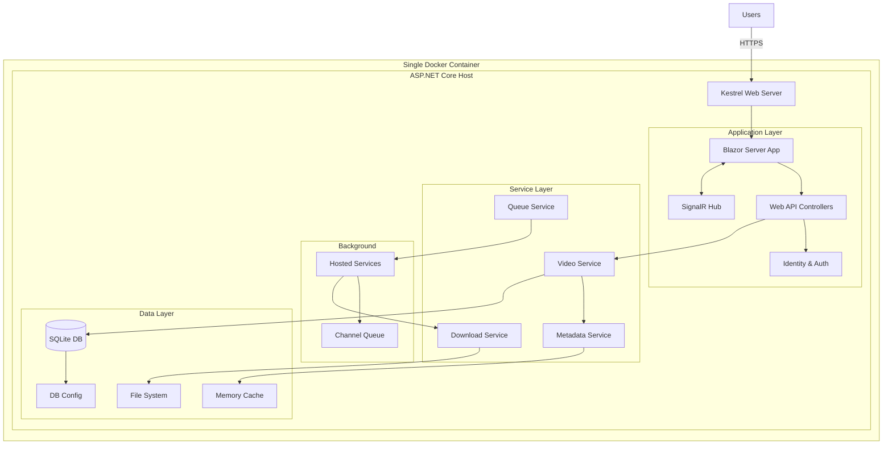

# Product Requirements Document: Video Jockey (C# Edition)

## Executive Summary
Video Jockey is a self-hosted, single-container web application for downloading, organizing, and managing music video collections with metadata sourced from IMVDb (Internet Music Video Database). This refactored version leverages the .NET ecosystem to provide a unified, performant, and easily deployable solution using C# throughout the entire stack.

## Product Overview

### Vision
Create a modern, self-contained web application that automates the acquisition and organization of music videos with rich metadata, deployed as a single Docker container for maximum simplicity and portability.

### Architecture Philosophy
- **Single Language**: C# across the entire stack
- **Single Container**: All components in one Docker image
- **Self-Hosted First**: Optimized for personal/small team deployment
- **Resource Efficient**: Minimal memory and CPU footprint
- **Zero External Dependencies**: Embedded database, no external services required

### Key Features
- Web-based user interface using Blazor Server or Blazor WebAssembly
- IMVDb integration for comprehensive metadata retrieval
- Automated video downloading from YouTube and other sources
- Kodi-compatible NFO metadata generation
- User authentication and session management
- Embedded SQLite database
- In-process background job processing
- Real-time download progress tracking via SignalR
- Single executable deployment option

## Technical Architecture

### Technology Stack (C# Unified)

**Core Platform**:
- **Framework**: ASP.NET Core 8.0
- **Runtime**: .NET 8.0 (with AOT compilation support)
- **Language**: C# 12.0

**Web Layer**:
- **UI Framework**: Blazor Server (recommended) or Blazor WebAssembly
- **CSS Framework**: Bootstrap 5 or Tailwind CSS (via CDN)
- **Component Library**: MudBlazor or Radzen Blazor
- **Real-time**: SignalR Core

**Data Layer**:
- **Database**: SQLite with Entity Framework Core 8.0
- **Configuration Storage**: All settings stored in database (no environment variables)
- **Caching**: In-Memory Cache (IMemoryCache)
- **File Storage**: Local filesystem with database-configured paths
- **Data Protection**: ASP.NET Core Data Protection API for encryption

**Application Services**:
- **Authentication**: ASP.NET Core Identity (simplified)
- **Authorization**: Policy-based with claims
- **Background Jobs**: IHostedService with Channels
- **Configuration**: Database-driven with admin UI
- **Dependency Injection**: Built-in Microsoft.Extensions.DependencyInjection
- **First-Run Setup**: Wizard for initial configuration

**External Integrations**:
- **HTTP Client**: HttpClient with Polly for resilience
- **REST Client**: Refit for type-safe API calls
- **Video Download**: YoutubeDL-Sharp or Process wrapper for yt-dlp
- **JSON**: System.Text.Json (built-in)
- **XML (NFO)**: System.Xml.Linq

**Development & Deployment**:
- **Container**: Docker with Alpine Linux base
- **Build**: MSBuild with PublishSingleFile
- **Logging**: Serilog with rolling file sink
- **Configuration**: IConfiguration with appsettings.json
- **Health Checks**: Built-in health check middleware

### Simplified Architecture



## Data Models (C# Classes)

### Core Entities

```csharp
// User entity
public class User
{
    public Guid Id { get; set; }
    public string Email { get; set; }
    public string Username { get; set; }
    public string PasswordHash { get; set; }
    public DateTime CreatedAt { get; set; }
    public DateTime? LastLogin { get; set; }
    public bool IsActive { get; set; } = true;
    public bool IsAdmin { get; set; } = false;
    public long StorageQuotaBytes { get; set; } = 52_428_800_000; // 50GB
    public long StorageUsedBytes { get; set; }
    public UserSettings Settings { get; set; }
}

// System Configuration (stored in database)
public class SystemConfiguration
{
    public int Id { get; set; } = 1; // Single row
    public DateTime LastModified { get; set; }
    
    // API Keys (encrypted in database)
    [Encrypted]
    public string ImvdbApiKey { get; set; }
    [Encrypted]
    public string YouTubeApiKey { get; set; }
    
    // Storage Settings
    public string MediaPath { get; set; } = "/media";
    public string TempPath { get; set; } = "/data/temp";
    public long MaxStorageBytes { get; set; } = 536_870_912_000; // 500GB
    
    // Download Settings
    public int ConcurrentDownloadLimit { get; set; } = 3;
    public string QualityPreference { get; set; } = "1080p";
    
    // Security Settings
    [Encrypted]
    public string JwtSecret { get; set; } // Auto-generated on first run
    public int JwtExpiryMinutes { get; set; } = 15;
    
    // System State
    public bool IsInitialized { get; set; } = false;
    public string AdminEmail { get; set; }
}

// Video entity
public class Video
{
    public Guid Id { get; set; }
    public Guid UserId { get; set; }
    public string ImvdbId { get; set; }
    public string YouTubeId { get; set; }
    public string Artist { get; set; }
    public string Title { get; set; }
    public string Album { get; set; }
    public int? Year { get; set; }
    public string Genre { get; set; }
    public string Director { get; set; }
    public string Studio { get; set; }
    public TimeSpan? Duration { get; set; }
    public string FilePath { get; set; }
    public long? FileSizeBytes { get; set; }
    public DownloadStatus Status { get; set; }
    public VideoSource ActualSource { get; set; }
    public bool SourceVerified { get; set; }
    public DateTime CreatedAt { get; set; }
    public DateTime? DownloadedAt { get; set; }
    public Dictionary<string, object> Metadata { get; set; }
}

// Download queue item
public class QueueItem
{
    public Guid Id { get; set; }
    public Guid VideoId { get; set; }
    public Guid UserId { get; set; }
    public QueuePriority Priority { get; set; }
    public QueueStatus Status { get; set; }
    public string SourceUrl { get; set; }
    public string ErrorMessage { get; set; }
    public int RetryCount { get; set; }
    public DateTime CreatedAt { get; set; }
    public DateTime? StartedAt { get; set; }
    public DateTime? CompletedAt { get; set; }
    public double ProgressPercent { get; set; }
}

// Enums
public enum DownloadStatus 
{ 
    NotDownloaded, Queued, Downloading, Completed, Failed 
}

public enum QueueStatus 
{ 
    Waiting, Processing, Completed, Failed, Cancelled 
}

public enum QueuePriority 
{ 
    Low = 0, Normal = 5, High = 10 
}

public enum VideoSource 
{ 
    Unknown, YouTube, Vimeo, Direct, Local 
}
```

## API Design (Minimal API Style)

### Endpoint Structure

```csharp
// Program.cs endpoint definitions
app.MapGroup("/api/auth")
    .MapIdentityApi<User>(); // Built-in Identity endpoints

var videos = app.MapGroup("/api/videos")
    .RequireAuthorization();

videos.MapGet("/", GetVideosAsync);
videos.MapGet("/{id}", GetVideoAsync);
videos.MapPost("/", CreateVideoAsync);
videos.MapPut("/{id}", UpdateVideoAsync);
videos.MapDelete("/{id}", DeleteVideoAsync);
videos.MapPost("/import", ImportVideosAsync);
videos.MapPost("/{id}/download", QueueDownloadAsync);

var queue = app.MapGroup("/api/queue")
    .RequireAuthorization();

queue.MapGet("/", GetQueueAsync);
queue.MapPost("/{id}/cancel", CancelQueueItemAsync);
queue.MapPost("/{id}/retry", RetryQueueItemAsync);
queue.MapPut("/{id}/priority", UpdatePriorityAsync);

var search = app.MapGroup("/api/search")
    .RequireAuthorization();

search.MapGet("/imvdb", SearchImvdbAsync);
search.MapGet("/youtube", SearchYouTubeAsync);

// SignalR hub
app.MapHub<DownloadHub>("/hubs/download");

// Health checks
app.MapHealthChecks("/health");
```

## Blazor UI Components

### Component Architecture

```
Components/
├── Layout/
│   ├── MainLayout.razor
│   ├── NavMenu.razor
│   └── LoginDisplay.razor
├── Videos/
│   ├── VideoGrid.razor
│   ├── VideoCard.razor
│   ├── VideoDetails.razor
│   └── VideoEditor.razor
├── Queue/
│   ├── QueueManager.razor
│   ├── QueueItem.razor
│   └── DownloadProgress.razor
├── Search/
│   ├── SearchBar.razor
│   ├── SearchResults.razor
│   └── SearchFilters.razor
└── Shared/
    ├── ConfirmDialog.razor
    ├── LoadingSpinner.razor
    └── ErrorBoundary.razor
```

### Real-time Updates with SignalR

```csharp
// DownloadHub.cs
public class DownloadHub : Hub
{
    public async Task SendProgress(Guid queueId, double percent, string status)
    {
        await Clients.User(Context.UserIdentifier)
            .SendAsync("DownloadProgress", queueId, percent, status);
    }
    
    public async Task SendQueueUpdate(QueueItem item)
    {
        await Clients.User(Context.UserIdentifier)
            .SendAsync("QueueUpdate", item);
    }
}

// Blazor component subscription
@code {
    protected override async Task OnInitializedAsync()
    {
        hubConnection = new HubConnectionBuilder()
            .WithUrl(NavigationManager.ToAbsoluteUri("/hubs/download"))
            .Build();
            
        hubConnection.On<Guid, double, string>("DownloadProgress", 
            (queueId, percent, status) =>
            {
                UpdateProgress(queueId, percent, status);
                InvokeAsync(StateHasChanged);
            });
            
        await hubConnection.StartAsync();
    }
}
```

## Deployment Configuration

### Single Container Dockerfile

```dockerfile
# Build stage
FROM mcr.microsoft.com/dotnet/sdk:8.0-alpine AS build
WORKDIR /src

# Copy project file
COPY ["VideoJockey.csproj", "."]
RUN dotnet restore

# Copy source code
COPY . .

# Build and publish
RUN dotnet publish -c Release -o /app/publish \
    --self-contained false \
    --runtime linux-musl-x64 \
    /p:PublishSingleFile=false \
    /p:PublishTrimmed=true \
    /p:PublishReadyToRun=true

# Runtime stage
FROM mcr.microsoft.com/dotnet/aspnet:8.0-alpine AS runtime
WORKDIR /app

# Install dependencies
RUN apk add --no-cache \
    python3 \
    py3-pip \
    ffmpeg \
    && pip3 install --no-cache-dir --break-system-packages yt-dlp

# Create user and directories
RUN adduser -D -u 1000 videojockey && \
    mkdir -p /data /media /config && \
    chown -R videojockey:videojockey /data /media /config

# Copy application
COPY --from=build /app/publish .
COPY --chown=videojockey:videojockey appsettings.json .

# Switch to non-root user
USER videojockey

# Environment variables
ENV ASPNETCORE_URLS=http://+:8080 \
    ASPNETCORE_ENVIRONMENT=Production \
    DOTNET_SYSTEM_GLOBALIZATION_INVARIANT=false \
    DATA_PATH=/data \
    MEDIA_PATH=/media \
    CONFIG_PATH=/config

# Expose port
EXPOSE 8080

# Health check
HEALTHCHECK --interval=30s --timeout=3s --start-period=5s --retries=3 \
    CMD wget --no-verbose --tries=1 --spider http://localhost:8080/health || exit 1

# Volume mounts
VOLUME ["/data", "/media", "/config"]

# Entry point
ENTRYPOINT ["dotnet", "VideoJockey.dll"]
```

### Docker Compose (Single Container)

```yaml
version: '3.8'

services:
  videojockey:
    image: videojockey:latest
    container_name: videojockey
    restart: unless-stopped
    ports:
      - "8080:8080"
    volumes:
      - ./data:/data     # SQLite database and application data
      - ./media:/media   # Video storage
    # No environment variables needed - all config in database!
    labels:
      - "traefik.enable=true"
      - "traefik.http.routers.videojockey.rule=Host(`videojockey.local`)"
      - "traefik.http.services.videojockey.loadbalancer.server.port=8080"
```

## Configuration Management

### appsettings.json

```json
{
  "Logging": {
    "LogLevel": {
      "Default": "Information",
      "Microsoft.AspNetCore": "Warning"
    }
  },
  "ConnectionStrings": {
    "DefaultConnection": "Data Source=/data/videojockey.db"
  },
  "DataProtection": {
    "KeysPath": "/data/keys"
  }
  // All other configuration stored in database
  // and managed through the admin UI
}
```

## Background Services

### Download Service Implementation

```csharp
public class DownloadBackgroundService : BackgroundService
{
    private readonly IServiceProvider _serviceProvider;
    private readonly Channel<QueueItem> _queue;
    private readonly ILogger<DownloadBackgroundService> _logger;
    
    protected override async Task ExecuteAsync(CancellationToken stoppingToken)
    {
        await foreach (var item in _queue.Reader.ReadAllAsync(stoppingToken))
        {
            using var scope = _serviceProvider.CreateScope();
            var downloadService = scope.ServiceProvider
                .GetRequiredService<IDownloadService>();
            var hubContext = scope.ServiceProvider
                .GetRequiredService<IHubContext<DownloadHub>>();
                
            try
            {
                await downloadService.ProcessDownloadAsync(
                    item, 
                    async (progress) =>
                    {
                        await hubContext.Clients
                            .User(item.UserId.ToString())
                            .SendAsync("DownloadProgress", 
                                item.Id, progress, stoppingToken);
                    },
                    stoppingToken);
            }
            catch (Exception ex)
            {
                _logger.LogError(ex, 
                    "Error processing download {QueueId}", item.Id);
            }
        }
    }
}
```

## Performance Optimizations

### Resource Efficiency

1. **Memory Management**
   - Use ArrayPool for large byte arrays
   - Implement IAsyncDisposable for resources
   - Configure GC for server workload
   - Limit concurrent operations

2. **Database Optimization**
   - Index frequently queried fields
   - Use projection for read operations
   - Implement pagination with cursor
   - Cache metadata lookups

3. **File Operations**
   - Stream large files instead of loading to memory
   - Use async I/O operations
   - Implement chunked uploads/downloads
   - Clean temporary files regularly

4. **Caching Strategy**
   - Cache IMVDb responses for 24 hours
   - Use distributed memory cache
   - Implement cache-aside pattern
   - ETags for static resources

### Startup Configuration

```csharp
var builder = WebApplication.CreateSlimBuilder(args);

// Configure SQLite database
var dataPath = Path.Combine(
    Environment.GetEnvironmentVariable("DATA_PATH") ?? "/data",
    "videojockey.db");
    
builder.Services.AddDbContext<VideoJockeyDbContext>(options =>
    options.UseSqlite($"Data Source={dataPath}"));

// Add Data Protection for encryption
builder.Services.AddDataProtection()
    .PersistKeysToFileSystem(new DirectoryInfo("/data/keys"))
    .SetApplicationName("VideoJockey");

// Add configuration service
builder.Services.AddScoped<IConfigurationService, ConfigurationService>();
builder.Services.AddMemoryCache();

// Add authentication (simplified)
builder.Services.AddAuthentication()
    .AddCookie(options =>
    {
        options.LoginPath = "/auth/login";
        options.LogoutPath = "/auth/logout";
    });

builder.Services.AddAuthorizationBuilder()
    .AddPolicy("User", policy => policy.RequireAuthenticatedUser());

// Add Blazor
builder.Services.AddRazorComponents()
    .AddInteractiveServerComponents();

// Add SignalR
builder.Services.AddSignalR(options =>
{
    options.EnableDetailedErrors = builder.Environment.IsDevelopment();
});

// Add background services
builder.Services.AddSingleton<Channel<QueueItem>>(
    Channel.CreateUnbounded<QueueItem>());
builder.Services.AddHostedService<DownloadBackgroundService>();

// Add application services
builder.Services.AddScoped<IVideoService, VideoService>();
builder.Services.AddScoped<IDownloadService, DownloadService>();
builder.Services.AddScoped<IMetadataService, MetadataService>();

// Add HTTP clients
builder.Services.AddHttpClient<ImvdbClient>();
builder.Services.AddHttpClient<YouTubeClient>();

// Add health checks
builder.Services.AddHealthChecks()
    .AddCheck<DatabaseHealthCheck>("database")
    .AddCheck<StorageHealthCheck>("storage");

var app = builder.Build();

// Configure pipeline
if (!app.Environment.IsDevelopment())
{
    app.UseExceptionHandler("/Error");
    app.UseHsts();
}

app.UseStaticFiles();
app.UseRouting();
app.UseAuthentication();
app.UseAuthorization();

app.MapRazorComponents<App>()
    .AddInteractiveServerRenderMode();

app.MapHealthChecks("/health");
app.MapHub<DownloadHub>("/hubs/download");

// Ensure database exists and is migrated
using (var scope = app.Services.CreateScope())
{
    var context = scope.ServiceProvider
        .GetRequiredService<VideoJockeyDbContext>();
    await context.Database.MigrateAsync();
}

// Check if system needs initialization
app.Use(async (context, next) =>
{
    var configService = context.RequestServices
        .GetRequiredService<IConfigurationService>();
        
    if (!await configService.IsSystemInitializedAsync()
        && !context.Request.Path.StartsWithSegments("/setup"))
    {
        context.Response.Redirect("/setup");
        return;
    }
    
    await next();
});

app.Run();
```

## Security Considerations

### Built-in Security Features

1. **Authentication**
   - ASP.NET Core Identity (simplified mode)
   - Cookie authentication for web UI
   - JWT for API access (optional)
   - Password policies enforced

2. **Authorization**
   - Policy-based authorization
   - User isolation for multi-tenancy
   - Resource-based permissions
   - API rate limiting

3. **Data Protection**
   - Data Protection API for secrets
   - HTTPS enforced in production
   - Secure cookie configuration
   - Input validation and sanitization

4. **Container Security**
   - Non-root user execution
   - Read-only root filesystem
   - Minimal base image (Alpine)
   - Security scanning in CI/CD

## Monitoring & Observability

### Built-in Monitoring

```csharp
// Health checks
public class DatabaseHealthCheck : IHealthCheck
{
    public async Task<HealthCheckResult> CheckHealthAsync(
        HealthCheckContext context,
        CancellationToken cancellationToken = default)
    {
        try
        {
            // Check database connection
            return HealthCheckResult.Healthy("Database is accessible");
        }
        catch (Exception ex)
        {
            return HealthCheckResult.Unhealthy(
                "Database check failed", ex);
        }
    }
}

// Metrics endpoint
app.MapGet("/metrics", () =>
{
    return new
    {
        Videos = videoService.GetCount(),
        QueueSize = queueService.GetQueueSize(),
        ActiveDownloads = downloadService.GetActiveCount(),
        StorageUsed = storageService.GetUsedSpace(),
        Uptime = Environment.TickCount64
    };
}).RequireAuthorization();
```


## Performance Targets

### Single Container Metrics
- **Memory Usage**: < 512MB under normal load
- **CPU Usage**: < 10% idle, < 50% during downloads
- **Startup Time**: < 5 seconds
- **Response Time**: < 100ms for UI, < 200ms for API
- **Concurrent Users**: Support 20+ simultaneous users
- **Download Throughput**: 100+ Mbps aggregate

### Resource Requirements
- **Minimum**: 1 CPU core, 512MB RAM, 10GB storage
- **Recommended**: 2 CPU cores, 1GB RAM, 100GB storage
- **Storage**: 1GB for application, rest for media

## Development Workflow

### Local Development

```bash
# Clone repository
git clone https://github.com/yourusername/video-jockey-csharp.git
cd video-jockey-csharp

# Restore dependencies
dotnet restore

# Run application
dotnet run

# Or use watch mode for hot reload
dotnet watch run

# Run tests
dotnet test

# Build Docker image
docker build -t videojockey:latest .

# Run container (no environment variables needed!)
docker run -d \
  -p 8080:8080 \
  -v ./data:/data \
  -v ./media:/media \
  --name videojockey \
  videojockey:latest

# Access setup wizard at http://localhost:8080/setup (first run only)
```

### Project Structure

```
VideoJockey/
├── VideoJockey.csproj
├── Program.cs
├── appsettings.json
├── appsettings.Development.json
├── Dockerfile
├── .dockerignore
├── Components/
│   ├── App.razor
│   ├── Routes.razor
│   ├── Layout/
│   ├── Pages/
│   └── Shared/
├── Services/
│   ├── VideoService.cs
│   ├── DownloadService.cs
│   ├── MetadataService.cs
│   └── QueueService.cs
├── Models/
│   ├── User.cs
│   ├── Video.cs
│   └── QueueItem.cs
├── Data/
│   ├── AppDbContext.cs
│   └── Migrations/
├── Hubs/
│   └── DownloadHub.cs
├── BackgroundServices/
│   └── DownloadBackgroundService.cs
├── wwwroot/
│   ├── css/
│   ├── js/
│   └── favicon.ico
└── Tests/
    ├── VideoJockey.Tests.csproj
    └── Services/
```

## Success Metrics

### Technical Success
- Single container deployment working
- Memory usage under 512MB
- Startup time under 5 seconds
- All features functional

### User Success
- Installation time < 5 minutes
- No external dependencies required
- Intuitive UI/UX
- Reliable download system

### Operational Success
- Zero-downtime updates
- Automated backups
- Simple configuration
- Easy troubleshooting

## Future Enhancements

### Phase 2: Advanced Features
- Plugin system using .NET assemblies
- Multiple theme support
- Advanced search with full-text indexing
- Batch operations UI
- Export/import functionality

### Phase 3: Extended Platform Support
- Native mobile apps using .NET MAUI
- Desktop application mode
- ARM64 support for Raspberry Pi
- FreeBSD/OpenBSD support

### Phase 4: Enterprise Features
- LDAP/AD authentication
- Multi-node clustering
- S3-compatible storage
- Prometheus metrics export
- OpenTelemetry support

## Conclusion

This refactored version of Video Jockey leverages the power and simplicity of the .NET ecosystem to deliver a unified, efficient, and easily deployable music video management solution. By using C# throughout the entire stack and optimizing for single-container deployment, we achieve:

1. **Simplified Development**: One language, one framework
2. **Easy Deployment**: Single Docker container
3. **Resource Efficiency**: Minimal memory and CPU usage
4. **Self-Contained**: No external dependencies
5. **Modern Features**: Real-time updates, responsive UI
6. **Production Ready**: Built-in security, monitoring, and health checks

The architecture prioritizes simplicity without sacrificing functionality, making it ideal for self-hosted deployments while maintaining the flexibility to scale when needed.