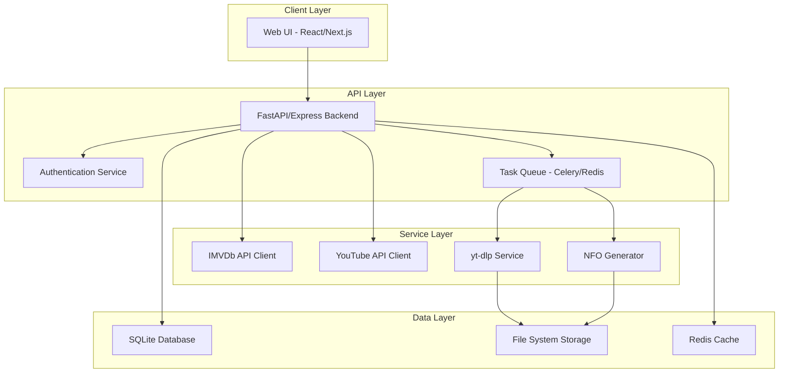

# Product Requirements Document: Video Jockey

## Executive Summary
Video Jockey is a web-based application for downloading, organizing, and managing music video collections with metadata sourced from IMVDb (Internet Music Video Database). The application provides a user-friendly web interface for managing music videos, generating Kodi-compatible metadata, and maintaining a structured media library.

## Product Overview

### Vision
Create a modern web application that automates the acquisition and organization of music videos with rich metadata, replacing manual CSV-based workflows with an intuitive web interface.

### Key Features
- Web-based user interface for music video management
- IMVDb integration for comprehensive metadata retrieval
- Automated video downloading from YouTube and other sources
- Kodi-compatible NFO metadata generation
- User authentication and session management
- SQLite database for persistent storage
- Batch processing and queue management
- Real-time download progress tracking

## User Personas

### Primary User: Media Collector
- Maintains large music video collections
- Values accurate metadata and organization
- Familiar with media center software (Kodi)
- Requires efficient batch processing capabilities

### Secondary User: Casual User
- Occasional music video downloads
- Prefers simple, intuitive interfaces
- Limited technical knowledge
- Focuses on individual video management

## Functional Requirements

### 1. Authentication & User Management

#### 1.1 User Registration
- Email-based registration
- Password requirements (minimum 8 characters, mixed case, numbers)
- Email verification optional (configurable)

#### 1.2 User Login
- Forms-based authentication
- Session management with secure cookies
- Remember me functionality (30-day sessions)
- Password reset via email

#### 1.3 User Profiles
- Profile management (email, display name)
- API key management (IMVDb, YouTube)
- Storage quota tracking
- Download history

### 2. Music Video Search & Discovery

#### 2.1 IMVDb Integration
- Search by artist, title, year, director
- Advanced filters (genre, decade, label)
- Browse trending/popular videos
- Artist discography view
- Director filmography view

#### 2.2 Search Results
- Grid/list view toggle
- Thumbnail previews from IMVDb
- Quick metadata preview
- Batch selection for operations
- Pagination (25/50/100 items per page)

### 3. Video Management

#### 3.1 Add Videos
- **Manual Entry**: Form for artist, title, year, etc.
- **IMVDb Import**: Select from search results
- **CSV Import**: Bulk import with field mapping
- **Library Import**: Scan and import existing video files
- **Duplicate Detection**: Check existing library

#### 3.2 Metadata Editing
- Edit all metadata fields
- Bulk edit for multiple videos
- Auto-complete from IMVDb suggestions
- Tag management with predefined categories
- Custom field support

#### 3.3 Download Queue

**Queue Management**:
- Add to queue from search or library
- Priority levels (High/Normal/Low)
- Pause/resume/cancel downloads
- Retry failed downloads
- Schedule downloads (off-peak hours)

**Download Sources**:
- YouTube (primary)
- Vimeo support
- Direct URL input
- Source preference settings
- Fallback source ordering

**Download Options**:
- Quality selection (1080p/720p/480p/best available)
- Format preference (MP4 preferred)
- Rate limiting configuration
- Concurrent download limits

### 4. Library Organization

#### 4.1 File Structure
```
media_library/
├── artist_name/
│   ├── artist.nfo
│   ├── video_title_1/
│   │   ├── video_title_1.mp4
│   │   └── video_title_1.nfo
│   └── video_title_2/
│       ├── video_title_2.mp4
│       └── video_title_2.nfo
```

#### 4.2 Naming Convention
- Lowercase conversion
- Special character removal
- Diacritic normalization
- Space to underscore replacement
- Configurable naming rules

#### 4.3 NFO Generation

**Video NFO** (Kodi musicvideo format):
```xml
<?xml version="1.0" encoding="UTF-8" standalone="yes"?>
<musicvideo>
    <title>Song Title</title>
    <artist>Artist Name</artist>
    <album>Album Name</album>
    <year>2024</year>
    <genre>Pop</genre>
    <director>Director Name</director>
    <studio>Record Label</studio>
    <plot>Video description from IMVDb</plot>
    <runtime>210</runtime>
    <premiered>2024-01-15</premiered>
    <tag>Official Video</tag>
    <tag>4K</tag>
    <imvdb_id>12345</imvdb_id>
    <youtube_id>abc123</youtube_id>
    <sources>
        <url ts="2024-01-15T10:30:00" source="youtube">https://youtube.com/watch?v=abc123</url>
    </sources>
</musicvideo>
```

**Artist NFO**:
```xml
<?xml version="1.0" encoding="UTF-8" standalone="yes"?>
<artist>
    <name>Artist Name</name>
    <genre>Pop</genre>
    <formed>1995</formed>
    <biography>Artist biography from IMVDb</biography>
    <thumb>artist_image_url</thumb>
    <fanart>artist_fanart_url</fanart>
</artist>
```

### 5. User Interface

#### 5.1 Dashboard
- Library statistics (total videos, artists, storage used)
- Recent downloads
- Queue status
- System notifications
- Quick actions (add video, import CSV)

#### 5.2 Library View
- **Grid View**: Thumbnail cards with hover details and source indicators
- **List View**: Tabular with sortable columns including source verification
- **Filters**: Genre, year, director, tags, download status, source match status
- **Search**: Real-time filtering
- **Bulk Actions**: Select multiple for operations
- **Source Indicators**: Visual badges showing source verification status

#### 5.3 Video Details Page
- Video player (if downloaded)
- Full metadata display with source verification panel
- Edit capabilities
- Download history and source information
- Source mismatch warnings with alternative source finder
- Related videos (same artist/director)
- Export options

#### 5.4 Queue Management
- Active downloads with progress bars
- Queued items with reordering
- Failed downloads with error details
- Completed downloads log
- Global pause/resume controls

#### 5.5 Settings
- **Profile**: User information, password change
- **API Keys**: IMVDb, YouTube API configuration
- **Download**: Quality preferences, concurrent limits
- **Library**: Storage paths, naming conventions
- **Notifications**: Email alerts, webhook integration

## Data Models

### User Model
```sql
CREATE TABLE users (
    id INTEGER PRIMARY KEY AUTOINCREMENT,
    email TEXT UNIQUE NOT NULL,
    username TEXT UNIQUE NOT NULL,
    password_hash TEXT NOT NULL,
    created_at TIMESTAMP DEFAULT CURRENT_TIMESTAMP,
    last_login TIMESTAMP,
    is_active BOOLEAN DEFAULT 1,
    storage_quota_mb INTEGER DEFAULT 50000,
    storage_used_mb INTEGER DEFAULT 0
);
```

### Video Model
```sql
CREATE TABLE videos (
    id INTEGER PRIMARY KEY AUTOINCREMENT,
    user_id INTEGER REFERENCES users(id),
    imvdb_id TEXT,
    youtube_id TEXT,
    artist TEXT NOT NULL,
    title TEXT NOT NULL,
    album TEXT,
    year INTEGER,
    genre TEXT,
    director TEXT,
    studio TEXT,
    runtime_seconds INTEGER,
    file_path TEXT,
    file_size_mb INTEGER,
    download_status TEXT CHECK(download_status IN ('pending', 'downloading', 'completed', 'failed', 'not_downloaded')),
    actual_source TEXT,
    source_verified BOOLEAN DEFAULT 0,
    source_mismatch_type TEXT,
    created_at TIMESTAMP DEFAULT CURRENT_TIMESTAMP,
    downloaded_at TIMESTAMP,
    last_modified TIMESTAMP,
    metadata_json TEXT,
    UNIQUE(user_id, artist, title)
);
```

### Download Queue Model
```sql
CREATE TABLE download_queue (
    id INTEGER PRIMARY KEY AUTOINCREMENT,
    video_id INTEGER REFERENCES videos(id),
    user_id INTEGER REFERENCES users(id),
    priority INTEGER DEFAULT 5,
    status TEXT CHECK(status IN ('waiting', 'downloading', 'completed', 'failed', 'cancelled')),
    source_url TEXT,
    error_message TEXT,
    retry_count INTEGER DEFAULT 0,
    created_at TIMESTAMP DEFAULT CURRENT_TIMESTAMP,
    started_at TIMESTAMP,
    completed_at TIMESTAMP
);
```

### API Keys Model
```sql
CREATE TABLE api_keys (
    id INTEGER PRIMARY KEY AUTOINCREMENT,
    user_id INTEGER REFERENCES users(id),
    service TEXT CHECK(service IN ('imvdb', 'youtube')),
    api_key TEXT NOT NULL,
    is_active BOOLEAN DEFAULT 1,
    created_at TIMESTAMP DEFAULT CURRENT_TIMESTAMP,
    last_used TIMESTAMP,
    UNIQUE(user_id, service)
);
```

## API Integrations

### IMVDb API

**Endpoints Required**:
- `/search` - Search for music videos
- `/video/{id}` - Get video details
- `/artist/{id}` - Get artist information
- `/director/{id}` - Get director information
- `/charts` - Get popular/trending videos

**Rate Limiting**:
- Respect API rate limits (typically 1000/day for free tier)
- Implement exponential backoff
- Cache responses for 24 hours

**Data Mapping**:
- Map IMVDb fields to internal schema
- Store raw JSON for future reference
- Handle missing/partial data gracefully

### YouTube Data API v3

**Endpoints Required**:
- `/search` - Find music videos
- `/videos` - Get video details
- `/channels` - Get channel information

**Features**:
- Search for videos when IMVDb URL not available
- Verify video availability
- Get video duration and quality information
- Prefer official/VEVO channels

### yt-dlp Integration

**Configuration**:
```python
yt_dlp_opts = {
    'format': 'bestvideo[ext=mp4]+bestaudio[ext=m4a]/best[ext=mp4]',
    'merge_output_format': 'mp4',
    'outtmpl': '%(title)s.%(ext)s',
    'quiet': True,
    'no_warnings': True,
    'extract_flat': False,
    'socket_timeout': 30,
    'retries': 3,
    'fragment_retries': 3,
    'sleep_interval': 1,
    'max_sleep_interval': 5,
}
```

## Technical Architecture

### Technology Stack

**Backend**:
- **Framework**: FastAPI (Python) or Express.js (Node.js)
- **Database**: SQLite with SQLAlchemy ORM
- **Task Queue**: Celery with Redis or Background Tasks
- **Authentication**: JWT tokens with secure cookies
- **Video Processing**: yt-dlp, ffmpeg

**Frontend**:
- **Framework**: React with Next.js or Vue.js with Nuxt
- **UI Components**: Material-UI or Ant Design
- **State Management**: Redux or Zustand
- **API Client**: Axios with interceptors
- **Video Player**: Video.js or Plyr

**Infrastructure**:
- **Deployment**: Docker containers
- **Reverse Proxy**: Nginx
- **Process Manager**: PM2 or Supervisor
- **Monitoring**: Prometheus + Grafana

### System Architecture



### API Endpoints

**Authentication**:
- `POST /api/auth/register` - User registration
- `POST /api/auth/login` - User login
- `POST /api/auth/logout` - User logout
- `POST /api/auth/refresh` - Refresh token
- `POST /api/auth/reset-password` - Password reset

**Videos**:
- `GET /api/videos` - List user's videos
- `GET /api/videos/{id}` - Get video details
- `POST /api/videos` - Add new video
- `PUT /api/videos/{id}` - Update video metadata
- `DELETE /api/videos/{id}` - Delete video
- `POST /api/videos/import` - Import from CSV
- `POST /api/videos/scan` - Scan existing library
- `GET /api/videos/{id}/verify-source` - Verify video source

**Search**:
- `GET /api/search/imvdb` - Search IMVDb
- `GET /api/search/youtube` - Search YouTube
- `GET /api/search/library` - Search user library

**Queue**:
- `GET /api/queue` - Get queue status
- `POST /api/queue` - Add to queue
- `PUT /api/queue/{id}` - Update queue item
- `DELETE /api/queue/{id}` - Remove from queue
- `POST /api/queue/{id}/retry` - Retry failed download

**Settings**:
- `GET /api/settings` - Get user settings
- `PUT /api/settings` - Update settings
- `POST /api/settings/api-keys` - Add API key
- `DELETE /api/settings/api-keys/{service}` - Remove API key

## Security Requirements

### Authentication & Authorization
- Bcrypt password hashing with salt
- JWT tokens with short expiration (15 minutes)
- Refresh tokens in HTTP-only cookies
- CSRF protection on state-changing operations
- Rate limiting on authentication endpoints

### Data Protection
- HTTPS only deployment
- Encrypted API keys in database
- Sanitize file names to prevent path traversal
- Validate all user inputs
- SQL injection prevention via parameterized queries

### Access Control
- Users can only access their own videos
- Admin role for system management
- API key scoping per user
- File system isolation per user

## Performance Requirements

### Response Times
- API responses < 200ms (p95)
- Search results < 500ms
- Page load < 2 seconds
- Video metadata generation < 5 seconds

### Scalability
- Support 100 concurrent users
- Handle 10 simultaneous downloads
- Process CSV imports up to 10,000 rows
- Store metadata for 100,000+ videos

### Resource Limits
- Max video file size: 2GB
- Max CSV import: 50MB
- Max concurrent downloads per user: 3
- API rate limits: 100 requests/minute

## Monitoring & Analytics

### Application Metrics
- Active users count
- Videos downloaded per day
- Storage usage trends
- API usage by endpoint
- Download success/failure rates

### Error Tracking
- Failed downloads with reasons
- API errors (IMVDb, YouTube)
- System errors with stack traces
- User action failures

### Usage Analytics
- Most downloaded artists
- Popular genres
- Peak usage times
- Feature adoption rates

## Deployment & Operations

### Installation Requirements
- Python 3.9+ or Node.js 18+
- FFmpeg 4.0+
- SQLite 3.35+
- Redis 6.0+ (for queue)
- 10GB minimum disk space

### Configuration
```yaml
# config.yaml
app:
  name: "Video Jockey"
  version: "1.0.0"
  debug: false
  
database:
  url: "sqlite:///./videojockey.db"
  
storage:
  media_path: "/media/music_videos"
  temp_path: "/tmp/videojockey"
  max_size_gb: 500
  
apis:
  imvdb:
    base_url: "https://imvdb.com/api/v1"
    timeout: 30
  youtube:
    api_version: "v3"
    max_results: 50
    
download:
  concurrent_limit: 3
  retry_attempts: 3
  quality_preference: "1080p"
  rate_limit_mbps: 10
  
security:
  jwt_secret: "generate-strong-secret"
  jwt_expiry_minutes: 15
  password_min_length: 8
  
email:
  smtp_host: "smtp.gmail.com"
  smtp_port: 587
  from_address: "noreply@videojockey.app"
```

### Backup Strategy
- Daily SQLite database backups
- Weekly full media library backups
- Configuration file versioning
- User-initiated export functionality

## Future Enhancements

### Phase 2 Features
- Mobile responsive design
- Playlist creation and management
- Social features (sharing, recommendations)
- Advanced duplicate detection
- Subtitle download support
- Multi-language metadata
- Comprehensive existing library import (see VideoJockey.library-import.md)
- Advanced source verification and matching

### Phase 3 Features
- Machine learning for video recommendations
- Automatic video quality upscaling
- Integration with other media databases
- Cloud storage support (S3, Google Drive)
- Advanced analytics dashboard
- Plugin system for extensibility

## Success Metrics

### User Adoption
- 100+ active users within 3 months
- 70% user retention after 1 month
- 10,000+ videos managed

### Performance
- 95% download success rate
- < 1% system downtime
- 90% of searches return results

### User Satisfaction
- 4+ star rating in feedback
- < 5% support ticket rate
- 50% feature adoption rate

## Risk Mitigation

### Technical Risks
- **API Changes**: Abstract API clients, version detection
- **Download Failures**: Multiple source fallbacks, retry logic
- **Data Loss**: Regular backups, transaction logging
- **Performance Issues**: Caching, database indexing

### Legal Risks
- **Copyright**: Clear disclaimer, user responsibility
- **API Terms**: Comply with rate limits, terms of service
- **Data Privacy**: GDPR compliance, data encryption

## Appendix

### A. IMVDb API Documentation Reference
- API documentation should be referenced at https://imvdb.com/developers/api
- Authentication via API key in headers
- JSON responses with standardized schema

### B. Glossary
- **NFO**: XML metadata file format used by Kodi
- **IMVDb**: Internet Music Video Database
- **yt-dlp**: YouTube download tool (youtube-dl fork)
- **Kodi**: Open source media center software

### C. References
- Kodi NFO specifications: https://kodi.wiki/view/NFO_files
- yt-dlp documentation: https://github.com/yt-dlp/yt-dlp
- IMVDb API: https://imvdb.com/developers/api
- YouTube Data API: https://developers.google.com/youtube/v3

---

## Document History
- Version 1.0.0 - Initial release
- Created: 2024
- Last Modified: 2024
- Author: Video Jockey Team